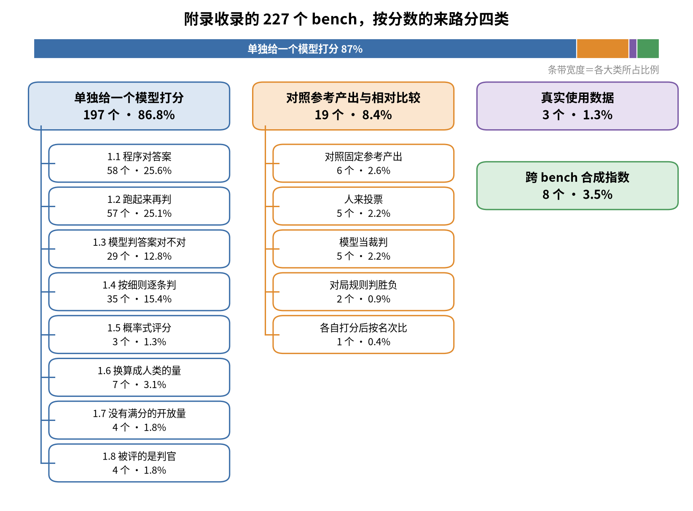

# 大模型评测的最后一步：分数是怎么算出来的

模型的输出有了以后，还要经过判对错、合并多次采样、合并多个判官、把一整套题合成一个数这几步，才变成榜单上的那个分数。这几步的选择能让同一个评测的数字差出好几倍。这本小书讲清楚这些步骤：按分数的来路把评测分成四类，单独给一个模型打分、对照参考产出与相对比较、真实使用数据、跨 bench 合成指数，中间讲各层怎么合并，再讲一个分数能信多少，最后用这些知识读懂十几个主流榜单。正文里的数值例子都可以用仓库里的脚本复现，附录列出书中涉及的 227 个 bench。



第一类占了八成多，在第 1 章里分八个小类，每个小类一节；第二类按对手和裁判分成五种。图里每一格的数字都来自 [data/benchmarks.csv](data/benchmarks.csv) 的「属于哪一类」和「小类」两列。

## 目录

| 章 | 主题 | 一句话 |
|---|---|---|
| [引言](book/introduction.md) | 一个分数是怎么来的 | 同一份判定换一种算法，数字可以差好几倍；四种出分方式和全书的读法 |
| [第 1 章](book/chapter1.md) | 单独给一个模型打分 | 程序对答案、跑起来再判、模型判答案对不对、按细则逐条判、概率式评分、换算成人类的量、没有满分的开放量、被评的是判官 |
| [第 2 章](book/chapter2.md) | 合并：从一条判定到一个总分 | 一道题里的多条检查、多个判官、同一道题跑多次、整套题合成一个分；合并的维度和顺序都会改变结果 |
| [第 3 章](book/chapter3.md) | 对照参考产出与相对比较 | 固定参考和流动的对手池，从 Elo 到 Bradley–Terry，平局、裁判噪声、长度偏好和配对，新模型一来老分就变 |
| [第 4 章](book/chapter4.md) | 真实使用数据 | 从真实会话里估计换一个模型的提升 |
| [第 5 章](book/chapter5.md) | 跨 bench 合成指数 | 加权和、项目反应理论、按名次合并和不合并 |
| [第 6 章](book/chapter6.md) | 一个分数能信多少 | 跑法和用户模拟器、谁决定送什么进来、误差条、分数怎么过期 |
| [第 7 章](book/chapter7.md) | 读懂几个主流榜单 | Artificial Analysis、LMArena、Vals、SEAL、METR、Epoch 等榜单的头条数字各自怎么来 |
| [附录](book/appendix.md) | 书中涉及的 bench | 这些 bench 的来路；227 个 bench 按大类和小类分组：怎么判、怎么合成总分 |

## 数据和脚本

[data/benchmarks.csv](data/benchmarks.csv) 是附录背后的完整数据，共 227 行，每行一个 bench，列出领域、属于哪一类、小类、谁来判、跟什么比、一道题内怎么合、多次采样怎么合、整套题怎么合成总分、是否依赖其他参评模型、报告的数字、谁在报这个分、发布时间和来源链接。

前三个脚本只用 Python 标准库，固定了随机种子；画图脚本另需 matplotlib：

```bash
python3 scripts/basics.py        # 采样合并、Elo 与 BT、风格控制、IPS、METR、跨 bench 合并、误差条
python3 scripts/mechanisms.py    # Plackett–Luce、平局模型、合成对局、支配分、Codeforces 换算、判官合并
python3 scripts/build_appendix.py  # 由 data/benchmarks.csv 生成 book/appendix.md
python3 scripts/make_figures.py    # 生成 images/ 下的插图，需要 matplotlib 和中文字体
```

正文里写作 "`python3 scripts/basics.py` §3" 的地方，指脚本输出中对应编号的一节。两份输出也保存在 [scripts/basics.out.txt](scripts/basics.out.txt) 和 [scripts/mechanisms.out.txt](scripts/mechanisms.out.txt)。
