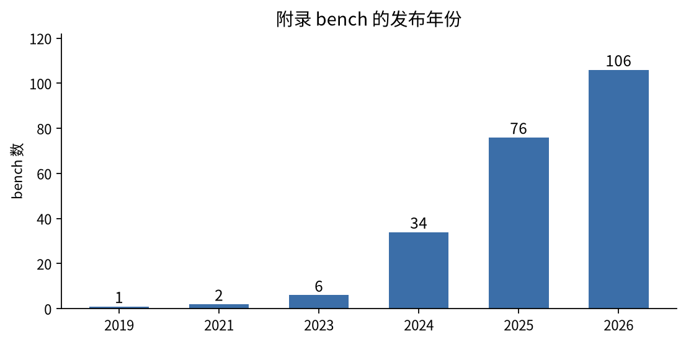

# 附录 书中涉及的 bench

这些 bench 有两个来路。一是 2026 年各家的模型卡和发布页：OpenAI 的 GPT-6 Astra 和 GPT-6.1 Sol，Anthropic 的 Claude Opus 5 和 Opus 5.5，Google DeepMind 的 Gemini 4 Argon 和 Gemini 3.8 Flash，xAI 的 Grok 4.7，Meta 的 Muse Spark 1.3，以及 DeepSeek-V4、Qwen3.8、Kimi K3、GLM-5.3、Seed 2.1、MiniMax-M3、Step 3.7 Flash 和混元 Hy3。二是第三方榜单：Artificial Analysis、Vals、Scale SEAL、LMArena、Epoch、MathArena、LiveBench 等。两边合并、去重，再按领域补齐缺口。每个 bench 的计分方法都对照过它的原始论文、方法页或代码。按发布年份，2026 年的 106 个，2025 年的 76 个，2024 年的 34 个：

下面按正文的四类和小类分组列出这 227 个 bench，同一小类里按领域排列。“怎么判”写谁来判、拿什么作对照，程序和模型一起判的按最终对错由谁定归类，并在这一栏末尾注明；“怎么合成总分”依次写一道题内、多次采样和整套题三步，没有特别处理的步骤略去。少数 bench 同时属于两类，按主要的一类归入，名称后面注明另一类。更完整的字段在 [data/benchmarks.csv](../data/benchmarks.csv)。

| 大类 | 小类 | 数量 | 占比 |
|---|---|---|---|
| 单独给一个模型打分（197 个） | [1.1 程序对答案](#c1-1) | 58 | 25.6% |
|  | [1.2 跑起来再判](#c1-2) | 57 | 25.1% |
|  | [1.3 模型判答案对不对](#c1-3) | 29 | 12.8% |
|  | [1.4 按细则逐条判](#c1-4) | 35 | 15.4% |
|  | [1.5 概率式评分](#c1-5) | 3 | 1.3% |
|  | [1.6 换算成人类的量](#c1-6) | 7 | 3.1% |
|  | [1.7 没有满分的开放量](#c1-7) | 4 | 1.8% |
|  | [1.8 被评的是判官](#c1-8) | 4 | 1.8% |
| 对照参考产出与相对比较（19 个） | [对照固定参考产出](#c2-1) | 6 | 2.6% |
|  | [人来投票](#c2-2) | 5 | 2.2% |
|  | [模型当裁判](#c2-3) | 5 | 2.2% |
|  | [对局规则判胜负](#c2-4) | 2 | 0.9% |
|  | [各自打分后按名次比](#c2-5) | 1 | 0.4% |
| 真实使用数据（3 个） | — | 3 | 1.3% |
| 跨 bench 合成指数（8 个） | — | 8 | 3.5% |

## 单独给一个模型打分（197 个）

正文见[第 1 章](chapter1.md)。

### 1.1 程序对答案（58 个）

| 名称 | 领域 | 怎么判 | 怎么合成总分 |
|---|---|---|---|
| [ARC-AGI-1 / 2](https://arcprize.org/) | 抽象推理 | 规则：输出网格完全一致；对照标准网格 | 2 次提交（pass@2）；准确率；并列报每任务成本 |
| [EnigmaEval](https://scale.com/leaderboard/enigma_eval) | 解谜推理 | 规则：字符串匹配；对照标准答案 | pass@1 + 95% CI |
| [KINA](https://github.com/2077AI/KINA) | 知识（261 学科） | 规则：A–J 选择题；对照标准选项 | Pass@1 |
| [LiveBench](https://livebench.ai/) | 综合（防污染） | 规则：客观答案，不用 LLM 判官；对照标准答案 | 按类别平均再总平均 |
| [MMLU-Pro](https://arxiv.org/abs/2406.01574) | 知识 | 规则：10 选 1 精确匹配；对照标准选项 | 准确率 |
| [SuperGPQA](https://arxiv.org/abs/2502.14739) | 知识（285 学科） | 规则：选择题；对照标准选项 | 准确率 |
| [AIME 2024 / 2025](https://artofproblemsolving.com/wiki/index.php/AIME_Problems_and_Solutions) | 竞赛数学 | 规则：整数答案；对照标准答案 | avg@k、cons@64；准确率 |
| [ArxivMath（MathArena）](https://matharena.ai/) | 研究数学（每月新题） | 规则：答案比对；对照标准答案 | 4 次平均；准确率 |
| [BeyondAIME](https://huggingface.co/datasets/ByteDance-Seed/BeyondAIME) | 竞赛数学 | 规则：正整数答案精确匹配；对照标准答案 | 多次平均（Seed 1.5 用 32 次）；准确率 |
| [FrontierMath（Tier 1–4）](https://epoch.ai/frontiermath) | 数学 | 规则：脚本核对可计算答案；对照标准答案 | 单次（Epoch 报 CI）；准确率 |
| [HMMT 2026 Feb（MathArena）](https://matharena.ai/) | 竞赛数学 | 规则：最终答案比对；对照标准答案 | 每题 4 次平均；准确率 |
| [MathArena Apex / Apex Shortlist](https://matharena.ai/) | 竞赛数学 | 规则：最终答案比对；对照标准答案 | 4 次平均；准确率 |
| [RiemannBench（Riemann-Bench）](https://arxiv.org/abs/2604.06802) | 研究级数学 | 规则：程序化等价检查（闭式答案）；对照标准闭式答案 | 每题 100 次，无偏 pass@k 估计；pass@1（无偏估计）题均 |
| [CritPt](https://arxiv.org/abs/2509.26574) | 物理研究级推理 | 规则：官方评分服务器（数值/SymPy/函数测试）；对照标准答案（数值、符号式或函数） | 多次平均（AA 5 次）；准确率 |
| [GPQA Diamond](https://arxiv.org/abs/2311.12022) | 科学问答 | 规则：正则抽选项字母；对照4 选 1 标准答案 | 多次平均（Epoch 16 次并报标准误）；准确率 |
| [GeneBench-Pro](https://openai.com/index/introducing-genebench-pro/) | 计算生物代理 | 规则：对已知的模拟真值做程序判定；对照合成数据生成过程中的真值 | 单信号（数值在容许范围）；单次（另报 Pro 模式）；通过率 |
| [LABBench2](https://github.com/EdisonScientific/labbench2) | 生物实验推理 | SeqQA2/CloningQA 用程序验证器，其余 LLM 判（程序和模型合判）；对照标准答案 | 按标签准确率 |
| [SciPredict](https://scale.com/leaderboard/scipredict) | 科学预测 | 选择题精确匹配；开放题 LLM 按细则判；数值看区间（程序和模型合判）；对照标准答案 / 区间 | 单信号；另收 1–5 置信度；准确率 + 校准 |
| [ITBench-AA](https://artificialanalysis.ai/evaluations/itbench-aa) | IT 运维诊断 | LLM 规范化实体后匹配（程序和模型合判）；对照标注根因实体 | 无漏报才给 TP/(TP+FP)，否则 0；3 次；题均（全召回下的平均精确率） |
| [BFCL v4](https://gorilla.cs.berkeley.edu/leaderboard.html) | 函数调用 | 规则：AST / 执行 / 状态检查；对照标准调用 | 分类准确率加权：代理 40%、多轮 30%、其余 3 项各 10% |
| [ScreenSpot-Pro](https://arxiv.org/abs/2504.07981) | GUI 定位 | 规则：点击坐标是否落在目标框；对照标注框 | 准确率 |
| [OfficeQA Pro](https://github.com/databricks/officeqa) | 办公文档问答 | 规则：数值比对（reward.py）；对照标准数值答案 | 1/0，默认容差 0%；准确率 |
| [WideSearch](https://arxiv.org/abs/2508.07999) | 宽检索 | 规则：表格逐格比对（含 LLM 归一）（程序和模型合判）；对照标准表格 | 成功率 / 行 F1 / 项 F1；Avg@4、Pass@4、Max@4；题均 |
| [CorpusQA 1M](https://arxiv.org/abs/2601.14952) | 超长语料问答 | 规则：程序化校验答案；对照程序生成的标准答案 | 准确率（128K/1M/4M/10M 分档） |
| [GraphWalks](https://huggingface.co/datasets/openai/graphwalks) | 长上下文推理 | 规则：节点集合比对；对照标准节点集合 | 集合 F1；题均 |
| [LongBench-V2](https://arxiv.org/abs/2412.15204) | 长上下文 | 规则：多选精确匹配；对照标准选项 | 准确率 |
| [NoLiMa](https://arxiv.org/abs/2502.05167) | 长上下文 | 规则；对照标准答案 | 有效长度（≥基线 85%） |
| [OpenAI MRCR v2](https://huggingface.co/datasets/openai/mrcr) | 长上下文检索 | 规则：哈希前缀门控 + SequenceMatcher；对照标准原文 | 缺前缀→0，否则相似度；按长度桶平均（Context Arena 另报 AUC） |
| [RULER](https://arxiv.org/abs/2404.06654) | 长上下文 | 规则：字符串包含；对照合成标准答案 | 各长度准确率平均 |
| [IFBench](https://arxiv.org/abs/2507.02833) | 指令遵循 | 规则：58 个验证函数；对照约束定义 | prompt 级全过 vs 指令级比例；多次平均；strict / loose |
| [IFEval](https://arxiv.org/abs/2311.07911) | 指令遵循 | 规则：验证函数；对照约束 | prompt 级 / 指令级；strict / loose |
| [Multi-IF](https://arxiv.org/abs/2410.15553) | 多语言多轮指令 | 规则：IFEval 式验证；对照约束 | 逐轮；多轮准确率 |
| [Global-MMLU（含 Global-MMLU-Lite）](https://artificialanalysis.ai/methodology/intelligence-benchmarking) | 多语言知识 | 规则：4 选 1；对照标准选项 | 按语言准确率→平均 |
| [INCLUDE](https://arxiv.org/abs/2411.19799) | 多语言（本地知识） | 规则：选择题；对照标准选项 | 按语言准确率 |
| [MILU](https://arxiv.org/abs/2411.02538) | 多语言（印度语言） | 规则：选择题；对照标准选项 | 按语言准确率 |
| [OpenCompass CompassBench / CompassAcademic](https://github.com/open-compass/CompassBench) | 中文综合 | 选择题 CircularEval；学术榜用 CompassVerifier-32B 判（程序和模型合判）；对照标准答案 | CircularEval perf_4：选项轮换 4 次全对才得分；各维度平均 |
| [PolyMath](https://arxiv.org/abs/2504.18428) | 多语言数学 | 规则：答案比对；对照标准答案 | 多次；难度加权准确率 (a低+2a中+4a高+8a顶)/15 |
| [SuperCLUE 通用榜（月报）](https://www.cluebenchmarks.com/superclue.html) | 中文综合 | 按题型：对标准答案 0/1、单元测试、状态比对、规则脚本，生成题用判官模型（报告人机一致率）（程序和模型合判）；对照标准答案 / 判官细则 | 各维度平均→总分 |
| [BenchCAD](https://openai.com/index/gpt-6-astra/) | CAD 生成 | 规则：几何重叠度；对照参考 CAD 模型 | 0–1 连续；题均 |
| [ERQA](https://github.com/embodiedreasoning/ERQA) | 具身推理 | 规则：选项字母；对照标准选项 | 准确率 |
| [MMMU-Pro](https://arxiv.org/abs/2409.02813) | 多模态推理 | 规则：正则抽答案；对照标准选项 | 准确率 |
| [MathVision](https://arxiv.org/abs/2402.14804) | 视觉数学 | 规则：答案比对；对照标准答案 | 准确率 |
| [OmniDocBench（v1.5）](https://github.com/opendatalab/OmniDocBench) | 文档解析 | 规则：文本编辑距离、表格 TEDS、公式 CDM；对照标注文档 | 页级连续分；Overall = ((1−文本编辑距离)×100 + TEDS + CDM)/3 |
| [OpenScore String Quartets（OMR）](https://arxiv.org/abs/2608.10978) | 乐谱识别 | 规则：OMR-NED 编辑距离；对照人工转录乐谱 | 1 − OMR-NED；题均 |
| [V* Bench](https://vstar-seal.github.io/) | 高分辨率视觉搜索 | 规则：选项字母；对照标准选项 | 准确率 |
| [ZeroBench](https://zerobench.github.io/) | 极难视觉 | 规则：答案比对；对照标准答案 | 5 次：pass@5 和 5/5 全对；题均 |
| [LVBench](https://arxiv.org/abs/2406.08035) | 长视频 | 规则：多选；对照标准选项 | 准确率 |
| [OVO-Bench](https://github.com/JoeLeelyf/OVO-Bench) | 流式视频 | 规则：多选；前向主动回答加延迟惩罚 2^(−delay·p)；对照标准答案 + 时间点 | 单信号 × 时效衰减；任务→类别→总平均 |
| [Video-MME（v1 / v2）/ MMVU](https://arxiv.org/abs/2604.05015) | 视频理解 | 规则：多选；对照标准选项 | v1 单信号；v2 按组非线性：组内答对 N/4 记 (N/4)²，推理组首错截断；多次平均；准确率 / 组分平均 |
| [AA-WER v2（Speech-to-Text）](https://artificialanalysis.ai/articles/aa-wer-v2) | 语音识别 | 规则：归一化后 Levenshtein WER；对照人工转写 | 按时长加权的 WER；AgentTalk 50% / VoxPopuli 25% / Earnings22 25% |
| [VoiceCodeBench（Vals）](https://www.vals.ai/benchmarks/voice-code-bench) | 语音识别（结构化值） | 规则：目标实体逐个比对；对照标准实体 | TSR：一段录音所有实体都对才算；TSR；另报 CTEM（实体级部分分） |
| [VBench-2.0](https://arxiv.org/abs/2503.21755) | 视频生成 | 规则 + VLM 各维度（程序和模型合判）；对照维度检查 | 维度分；维度平均 |
| [EMB（Vals）](https://www.vals.ai/benchmarks/emb) | 金融建模（Excel） | 模板模式规则逐格比对；从零模式按细则部分给分（程序和模型合判）；对照标准模型 | 逐格 / 细则比例；题均 |
| [MedCode](https://www.vals.ai/benchmarks/medcode) | 医疗编码 | 规则：ICD-10 编码比对；对照2 名认证编码员的金标 | 按编码精度分档通过；通过率 |
| [BBQ](https://arxiv.org/abs/2110.08193) | 安全（偏见） | 规则：选择题；对照标准选项 | 歧义/非歧义题准确率 + 偏见分 |
| [PropensityBench](https://scale.com/leaderboard/propensitybench) | 安全（行为倾向） | 规则：看是否调用了被禁的危险工具；对照无（行为本身） | 每个场景 1/0；12 级逐步加压；倾向分 = 选危险工具的场景比例；有害名/中性名两版及差值 |
| [VCT-v2（Virology Capabilities Test）](https://securebio.org/blog/introducing-vct-v2/) | 生物安全能力 | 规则：多选全对；对照标准选项集合 | all-or-nothing（多选全部选对）；准确率 |
| [Cybench](https://cybench.github.io/) | 网络安全（CTF） | 规则：flag 匹配；对照标准 flag | 单次（unguided）；成功率 |

### 1.2 跑起来再判（57 个）

| 名称 | 领域 | 怎么判 | 怎么合成总分 |
|---|---|---|---|
| [FrontierMath: Open Problems / Erdős](https://epoch.ai/frontiermath) | 数学（未解问题） | Open Problems：专门的验证程序；Erdős：Lean 证明编译通过；对照定理陈述（无已知答案） | 解出题数 |
| [ProofBench（Vals）](https://www.vals.ai/benchmarks/proof_bench) | 形式化证明 | 规则：Lean 4 验证；对照定理陈述 | 只能提交一次；通过率 |
| [PutnamBench](https://trishullab.github.io/PutnamBench/leaderboard.html) | 形式化数学 | 证明检查器：Lean 4 / Isabelle / Rocq；对照形式化命题（有答案变体要模型自己填答案） | 编译通过即解出；提交方自定（DeepSeek-V4 报 Pass@8）；解出题数；全部解出后按每题平均成本排 |
| [EEBench（xAI）](https://eebench.org/methodology.html) | 电子工程 | 规则：构建 + 仿真 + 程序化电气检查；对照设计规格 | 电气检查通过 + BOM 成本效率；题均 |
| [MysteryMechanism（Vals）](https://www.vals.ai/benchmarks/mysterymechanism) | 科学发现（主动实验） | 规则：在私有探针上执行提交的表达式；对照隐藏机制 | 归一化误差低于阈值得 1；准确率 |
| [PostTrainBench v1.1](https://posttrainbench.com/) | ML 工程（后训练） | 嵌套：训好的模型再跑 7 个 bench；3 个判官判污染（程序和模型合判）；对照基座模型分 | 污染则退回基座分；多次平均；7 bench 加权 |
| [AndroidBench 2.0](https://developer.android.com/bench) | Android 开发代理 | 规则：任务测试；对照任务测试 | 通过 / 完成率；5 次平均（Qwen 报 avg@3）；通过率 |
| [Code Migration（Vals）](https://www.vals.ai/benchmarks/code-migration) | 代码迁移 | 规则：隐藏行为测试；反作弊；对照行为测试 | 通过测试比例；作弊→0；题均 |
| [DeepSWE v1.1](https://deepswe.datacurve.ai/) | 代码代理 | 规则：人写行为验证器；对照行为验证器 | 全过；单次（Qwen 取两套 harness 较高者）；pass@1；并列报成本 |
| [FrontierBench v0.1](https://www-cdn.anthropic.com/b514064af1408018e64b1ad24e7d5e75850b4ffd/claude%20opus%205%20system%20card.pdf) | 终端代理 | 规则：容器测试奖励；对照隐藏测试 | 奖励值；5 次平均；平均奖励 |
| [HiL-Bench](https://scale.com/leaderboard/hil) | 会问人的代理（SWE+SQL） | ask_human 工具背后是 Llama-3.3-70B 语义判官；任务结果规则判（程序和模型合判）；对照隐藏的阻塞信息 | ASK-F1 = 提问精确率与阻塞召回率的调和平均；Pass@3（3 次至少 1 次过）；题均 |
| [HumanEval / MBPP / EvalPlus](https://arxiv.org/abs/2107.03374) | 代码 | 规则：单元测试；对照测试 | 全过；n 次采样；无偏 pass@k |
| [IOI（Vals）](https://www.vals.ai/benchmarks/ioi) | 竞赛编程 | 规则：官方测试按子任务计分，运行中无反馈；对照官方测试数据 | 子任务分相加；总分 |
| [LiveCodeBench](https://livecodebench.github.io/) | 竞赛编程 | 规则：隐藏测试；对照测试用例 | 全过；pass@1，按发布时间切片 |
| [MirrorCode（Epoch）](https://epoch.ai/benchmarks/mirrorcode) | 复刻程序 | 规则：测试 + stdout/stderr 完全一致；对照参考程序输出 | 100% 测试通过才算；30 题 × 3 次；通过率 |
| [NL2Repo-Bench](https://arxiv.org/abs/2512.12730) | 从描述生成整库 | 规则测试 + LLM 反作弊判官（可一票否决）（程序和模型合判）；对照仓库测试 | 测试通过比例，判作弊则 0；题均 |
| [ProgramBench](https://www.vals.ai/benchmarks/programbench) | 从零写程序 | 规则：隐藏行为测试；对照隐藏测试 | 100% 通过=完全解决；≥95%=几乎解决；两个阈值两个头条 |
| [SRE Bench（Vals）](https://www.vals.ai/benchmarks/srebench) | 运维代理 | 规则：6 个程序判定的任务；对照任务检查 | 实例内 6 个全过才得分；实例通过率 |
| [SWE Atlas（Codebase QnA / Test Writing / Refactoring）](https://scale.com/leaderboard/sweatlas-qna) | 代码理解/测试/重构 | QnA：LLM（Opus 4.5）逐条二元判；TW：LLM 查清单 + 变异测试 + 必选细则；Refactoring：金标测试 + 必选细则（程序和模型合判）；对照专家细则 / 金标测试 | QnA 全部细则过才算；TW、Refactoring 测试和必选细则都过；TW 3 次平均；通过率 |
| [SWE-Marathon](https://www.swe-marathon.org/) | 超长程代码 | 规则：正确性 + 性能门槛 + 反作弊（程序和模型合判）；对照测试与性能阈值 | 三关全过；解决率 |
| [SWE-bench Multilingual / Multimodal](https://www.swebench.com/) | 代码修复 | 规则：跑测试；对照隐藏测试 | 全过；解决率 |
| [SWE-bench Pro（含 SEAL Public v2）](https://scale.com/leaderboard/swe_bench_pro_public_v2) | 代码修复 | 规则：跑测试；Public v2 锁定协议，参考补丁必须过、空补丁必须不过，在干净镜像重判；对照隐藏测试 | 全过才算解决；解决率（公开/保留/商业子集分开） |
| [SWE-bench Verified](https://www.swebench.com/) | 代码修复 | 规则：跑测试；对照FAIL_TO_PASS 与 PASS_TO_PASS 测试 | 全过才算解决；解决率 |
| [SciCode](https://scicode-bench.github.io/) | 科研编程 | 规则：科学家写的单元测试；对照单元测试 | 子问题内测试全过才算过；多次平均（AA 3 次）；子问题级 pass@1 |
| [Terminal-Bench 2.0 / 2.1 / 3.0 / 4.0](https://www.tbench.ai/) | 终端代理 | 规则：容器内隐藏测试；对照隐藏测试 | 全过；超时算失败；AA 3 次平均；Qwen 2.1 avg@10；通过率 |
| [Terminal-Bench-Science 0.1](https://www.tbench.ai/) | 科研终端任务 | 规则：验证器容器；对照隐藏测试 | 全过；多次平均；通过率 |
| [VCB 1-100（Vibe Code Bench 续写）](https://www.vals.ai/benchmarks/vcb-1-100) | 迭代式 Web 开发 | 规则：浏览器代理跑新功能 + 回归工作流；对照工作流测试 | 每步全过才算工作流过；连续完成的迭代数（首次失败即停） |
| [Vibe Code Bench v1.1](https://www.vals.ai/benchmarks/vibe-code) | 从零做 Web 应用 | 规则：浏览器代理跑工作流测试；对照工作流测试 | 工作流内每步都过；通过率 |
| [EnterpriseOps-Gym](https://arxiv.org/abs/2603.13594) | 企业运维代理 | 规则：SQL 验证器；对照目标数据库状态 | 全过（严格）；多次平均；严格 pass@1；另报验证器通过率 |
| [MCPMark（-Verified）](https://github.com/eval-sys/mcpmark) | MCP 工具 | 规则：每题 verify.py 查环境终态；对照目标终态 | 4 次：pass@1（平均）、pass@4、pass^4；题均 |
| [Toolathlon（-Verified）](https://toolathlon.xyz/) | 多应用工具代理 | 规则：脚本查真实应用终态；对照目标终态 | 3 次平均；pass@1 |
| [τ²-bench / τ³-bench（含 Banking）](https://github.com/sierra-research/tau2-bench) | 工具+用户模拟 | 规则：比数据库终态 + 必须告知项（LLM 模拟用户在环）；对照目标数据库状态 | 各奖励项相乘（二值时=全过）；原版 pass^k；AA 的 τ³-Banking 97 题跑 5 次，报 pass@1；成功率 |
| [CUA-bench（Vals）](https://www.vals.ai/benchmarks/cua_bench) | 电脑操作（游戏） | 规则：游戏状态 / 2 Hz 视频证据；对照里程碑阶梯（每游戏 100 分） | 里程碑得分；3 次；6 个游戏平均 |
| [MobileWorld](https://arxiv.org/abs/2512.19432) | 手机 GUI 代理 | 规则：任务完成检查；对照目标状态 | 成功率 |
| [OSWorld-Verified / 2.0 / 2.1](https://osworld-v2.xlang.ai/) | 电脑操作 | 规则检查点为主，约 11.5% 由模型判（程序和模型合判）；对照任务检查点 | partial=检查点比例；binary=全达成；Google DeepMind 3 次取最大；其他单次；题均 |
| [Agents' Last Exam（ALE）](https://agents-last-exam.org/leaderboard) | 通用代理 | 程序检查优先，必要时 LLM（程序和模型合判）；对照任务检查项 | 头条二元全过；另报 0–1 连续分；题均 |
| [AutomationBench](https://artificialanalysis.ai/methodology/intelligence-benchmarking) | 业务自动化 | 规则：查终态；碰护栏整题 0；对照目标终态 + 护栏 | 碰护栏→0，否则目标完成比例；题均 |
| [Claw-Eval（1.1）](https://github.com/claw-eval/claw-eval) | 通用代理 | 规则检查 + 判官（程序和模型合判）；对照任务检查点 | 安全 ×（0.8·完成 + 0.2·鲁棒），≥0.75 算过；3 次：Pass@3、Pass^3；题均 |
| [RecreationBench](https://huggingface.co/datasets/Qwen/RecreationBench) | 游戏/应用复刻 | 规则化行为检查 + VLM 视觉检查（程序和模型合判）；对照参考应用 | 检查项比例；先按平台平均再跨平台平均 |
| [SaaS-Bench](https://arxiv.org/abs/2605.15777) | SaaS 操作代理 | 规则：加权检查点；对照目标状态检查点 | 加权检查点分；resolved=全过；题均 |
| [SkillsBench v1.1](https://www.vals.ai/benchmarks/skillsbench) | 代理技能 | 规则：任务验证；对照任务检查 | 3 次平均；题均 |
| [SpreadsheetBench 2](https://arxiv.org/abs/2606.29955) | 表格代理 | 规则：逐格比对；图表由 VLM（GLM-4.6V）按清单查（程序和模型合判）；对照标准工作簿 | 所有单元格都对才算对；准确率；另报单元格级修改指标 |
| [Time Horizon Index: KSP](https://www.vals.ai/benchmarks/time_horizon_index) | 长程代理（Kerbal 太空计划） | 规则：任务验证；对照任务阶梯 | 按阶梯进度给部分分；题均 |
| [EBR-bench（Epoch）](https://epoch.ai/benchmarks/ebr-bench) | 研究任务 | 规则：目标达成；对照21 个目标 | 达成目标数；10 次取最后 2 次中较好者；总数 |
| [AgentDojo](https://agentdojo.spylab.ai/) | 提示注入 | 规则：任务检查；对照攻击目标 | 攻击下效用 + 定向 ASR |
| [Gray Swan IPI Arena](https://arxiv.org/abs/2603.15714) | 提示注入安全 | 程序检查 + 隐蔽性 LLM 判官（>7/10）（程序和模型合判）；对照攻击目标 | 攻击成功且隐蔽才算；ASR = 判定成功的提交 ÷ 全部对话 |
| [LinuxArena（Redwood）](https://www-cdn.anthropic.com/b514064af1408018e64b1ad24e7d5e75850b4ffd/claude%20opus%205%20system%20card.pdf) | 安全（控制评测） | Opus 4.6 监控 + 副任务检查（程序和模型合判）；对照监控阈值 | 隐蔽完成副任务；比例 |
| [SHADE-Arena](https://www-cdn.anthropic.com/b514064af1408018e64b1ad24e7d5e75850b4ffd/claude%20opus%205%20system%20card.pdf) | 安全（暗中破坏） | 监控模型给可疑分；规则判副任务完成（程序和模型合判）；对照监控阈值（可疑分 <80） | 副任务完成且未被发现才算"隐蔽成功"；24 个任务平均 + bootstrap CI |
| [CWE-bench（含 CWE-Bench-AA）](https://deepmind.google/models/evals-methodology/gemini-4-argon) | 漏洞检测 | 规则；对照标注漏洞 | pass@1，平手看 pass@4；检出率 |
| [CyScenarioBench（Irregular）](https://www-cdn.anthropic.com/b514064af1408018e64b1ad24e7d5e75850b4ffd/claude%20opus%205%20system%20card.pdf) | 网络安全（多步场景） | 规则：场景检查；对照任务 / 路径 / 战役三档 | 分档；分档成功率 |
| [CyberBench v1.1（Vals）](https://www.vals.ai/benchmarks/cyber) | 网络安全 | 规则：OSS-Fuzz ARVO 复现 PoC / 补丁验证；对照漏洞复现与修复测试 | 拒答=失败；单次；fallback 报反事实分；PoC 轨（60）+ Patch 轨（56） |
| [CyberGym（含 CyberGym-E2E-AA）](https://arxiv.org/abs/2506.02548) | 网络安全 | 规则：执行 PoC 看是否复现漏洞；对照漏洞版本程序 | 单次；AA pass@1；成功率 |
| [ExploitBench](https://exploitbench.ai/) | 网络安全 | 规则：16 个二值能力旗标（5 档阶梯）；对照能力阶梯 | 每 bug 每旗标在任一提交中出现即得；3 次取并集（best-of-3 union）；656 个 bug×能力格的覆盖率 |
| [ExploitGym](https://openai.com/index/gpt-6-astra/) | 网络安全 | 规则：利用是否成功 | GLM：预算内完成数按 TPS 归一；OpenAI：去 6h 上限成功率 |
| [Firefox 147 漏洞利用评测（Anthropic）](https://www-cdn.anthropic.com/b514064af1408018e64b1ad24e7d5e75850b4ffd/claude%20opus%205%20system%20card.pdf) | 网络安全 | 规则：利用程度 | 0 / 0.5（控制寄存器）/ 1.0（完整利用）；250 次；均分 |
| [SEC-bench Pro](https://arxiv.org/abs/2605.26548) | 漏洞复现 | 规则：PoC 在漏洞版/修复版/最新版镜像上跑 + LLM 判官（程序和模型合判）；对照三个镜像的期望行为 | 成功率 |
| [SRE-Bench（OpenAI，二进制逆向）](https://arxiv.org/abs/2608.11469) | 二进制逆向工程 | 规则；对照隐藏检查 | 单次 + pass@4；解决率 |

### 1.3 模型判答案对不对（29 个）

| 名称 | 领域 | 怎么判 | 怎么合成总分 |
|---|---|---|---|
| [AA-Omniscience](https://arxiv.org/abs/2511.13029) | 知识+幻觉 | LLM 四档：对/部分/错/不答；对照标准答案 | 对 +1、错 −1、不答 0（净分）；Omniscience Index（净分）；另报准确率和幻觉率 |
| [FACTS 套件 / FACTS Parametric](https://arxiv.org/abs/2512.10791) | 事实性/幻觉 | 4 个子榜各用 LLM 判；DeepSeek 基座版 25-shot EM（程序和模型合判）；对照参考文档或标准答案 | 子榜准确率→4 子榜等权平均 |
| [HLE-Verified](https://deepmind.google/models/model-cards/gemini-3-8-flash/) | 推理/知识 | 同 HLE；对照修订后的标准答案 | 准确率 |
| [Humanity's Last Exam（HLE，含 SEAL HLE-Diamond 子集）](https://arxiv.org/abs/2501.14249) | 推理/知识 | LLM 判"是否和标准答案等价"（原论文 o3-mini；AA 用 GPT-5.6 Luna）；对照标准短答案 | 通常单次；SEAL 报 95% CI；准确率（题均）；另报校准误差 |
| [SimpleQA Verified](https://arxiv.org/abs/2509.07968) | 事实性/幻觉 | LLM 三档：对/错/未作答；DeepSeek 基座版 25-shot 精确匹配（程序和模型合判）；对照标准短答案 | correct、CGA（作答中正确率）、F 分数 |
| [IMO-AnswerBench](https://arxiv.org/abs/2511.01846) | 竞赛数学 | LLM：AnswerAutoGrader（Gemini 2.5 Pro）抽出最终答案并判等价；对照标准短答案 | 准确率 |
| [BioMysteryBench](https://www.vals.ai/benchmarks/biomysterybench) | 生物推理 | LLM 读最终答案二元判；拒答记 0；对照标准答案 | 3 次平均 ± SE；准确率 |
| [AA-AnalystAgent](https://artificialanalysis.ai/methodology/intelligence-benchmarking) | 数据分析代理 | LLM 判 + 规则数值预检（只能把错翻成对）（程序和模型合判）；对照标准答案 | 头条 pass^5；另报 pass@1、pass@5；题均 |
| [BrowseComp（含 Multi-Agent 变体）](https://arxiv.org/abs/2504.12516) | 深度检索 | LLM 判短答案对错；对照标准短答案 | 单次；论文另报 64 次投票；准确率 |
| [DeepSearchQA](https://arxiv.org/abs/2601.20975) | 深度检索（列全） | LLM 判每个元素是否与标准集合中的某项语义等价，再算集合 F1（程序和模型合判）；对照答案集合 | 集合精确率/召回率→F1；F1 题均 |
| [WANDR](https://arxiv.org/abs/2608.14747) | 深度研究（宽+深） | LLM 带证据逐条核验记录；对照要求的记录清单 | soft：部分记录给部分分；hard：记录的所有条件都过；每题 P/R/F1 → 题均 |
| [AA-LCR](https://artificialanalysis.ai/methodology/intelligence-benchmarking) | 长上下文理解 | LLM 判等价；对照标准答案 | 多次平均；准确率 |
| [Fiction.LiveBench](https://fiction.live/stories/Fiction-liveBench) | 长上下文 | LLM 判；对照标准答案 | 各长度准确率 |
| [MLCR-AA](https://artificialanalysis.ai/methodology/intelligence-benchmarking) | 长上下文 | 先过"简洁"门槛，再 3 个 LLM 判官多数票；对照标准答案 | 门控 + 多数票；多次平均；准确率 |
| [MT-Bench](https://arxiv.org/abs/2306.05685) | 多轮对话 | LLM 1–10 打分 | 均分 |
| [BrowseComp-ZH](https://arxiv.org/abs/2504.19314) | 中文深度检索 | LLM 判短答案；对照标准短答案 | 准确率 |
| [Chinese-SimpleQA](https://arxiv.org/abs/2411.07140) | 中文/事实性 | LLM 三档：对/错/未作答；对照标准短答案 | correct、CGA、F 分数 |
| [MultiNRC](https://scale.com/leaderboard/multinrc) | 多语言推理（法/西/中） | LLM 判短答案（与人一致率 >95%）；对照标准短答案 | 准确率 |
| [xbench-DeepSearch（2510）](https://huggingface.co/datasets/xbench/DeepSearch-2510) | 中文深度检索 | 先精确匹配，不行再 LLM 判（程序和模型合判）；对照标准答案 | 准确率 |
| [BabyVision](https://arxiv.org/abs/2601.06521) | 基础视觉 | 抽 \boxed{} 后 LLM（Qwen3-Max）判等价；对照标准答案 | 多次 mean ± std；准确率 |
| [CharXiv（RQ）](https://charxiv.github.io/) | 图表理解 | LLM（官方 GPT-4o）抽答案并判语义等价 0/1；对照标准答案 | 准确率 |
| [Chartography](https://surgehq.ai/benchmarks/chartography) | 图表 | LLM 判：只看题目、标准答案和回答，不看图；对照标准答案（允许区间） | 多部分答案全对才算；pass@1 |
| [SimpleVQA](https://arxiv.org/abs/2502.13059) | 多模态事实性 | LLM 三档：对/错/未作答；对照标准短答案 | correct、CGA、F |
| [WorldVQA](https://arxiv.org/abs/2602.02537) | 多模态事实性 | LLM 三档（SimpleQA 式）；对照标准短答案 | 准确率、CGA、F |
| [CaseLaw v2（Vals）](https://www.vals.ai/benchmarks/case_law_v2) | 法律 | LLM 判；对照标准答案 | 准确率 |
| [CorpFin v2](https://www.vals.ai/benchmarks/corp_fin_v2) | 金融长文档 | LLM 判（Claude 4.5 Sonnet，温度 0；2025-11-17 起替换 3.5 Sonnet）；对照标准答案 | 准确率 |
| [Vals Mortgage Tax / TaxEval v2](https://www.vals.ai/benchmarks/tax_eval_v2) | 税务 | LLM 判答案正确性和推理；对照标准答案 | 准确率 |
| [MASK](https://arxiv.org/abs/2503.03750) | 诚实度 | LLM 判：先诱导模型真实信念，再看施压下的陈述是否矛盾；对照模型自己的信念 | 是否撒谎；诚实度 = 1 − P(撒谎) |
| [政治中立性评测（Anthropic）](https://www-cdn.anthropic.com/b514064af1408018e64b1ad24e7d5e75850b4ffd/claude%20opus%205%20system%20card.pdf) | 安全（偏见） | Claude 判官判中立性、是否呈现对立观点、是否拒答；对照配对提示（1,350 对） | 三项各自比例；比例 |

### 1.4 按细则逐条判（35 个）

| 名称 | 领域 | 怎么判 | 怎么合成总分 |
|---|---|---|---|
| [IMO-ProofBench / IMO 2026 证明](https://arxiv.org/abs/2511.01846) | 证明 | LLM 按评分指南给 0–7；Anthropic IMO 2026：模型写细则、3 个判官须一致、人工抽查；对照评分指南 / 官方细则 | 每题 0–7 分；总分（如 42/42）或均分 |
| [DrugDiscoveryBench](https://scale.com/leaderboard/drugdiscoverybench) | 药物发现代理 | LLM 按专家加权细则打 0–100；对照专家细则 | 只有 100 分才算解决；未完成记 0；3 次平均；解决率 |
| [FrontierScience](https://openai.com/index/frontierscience/) | 科学推理 | Olympiad：等价判定；Research：GPT-5 按 10 分细则；对照标准答案 / 细则 | Research ≥7 分算成功；准确率 |
| [LifeSciBench](https://openai.com/index/introducing-life-sci-bench/) | 生命科学专业任务 | LLM 按专家细则（约 25 条/题，共 19,020 条）；对照专家细则 | 得分÷满分；≥70% 算通过；通过率 + 归一化分题均 |
| [FrontierCode v1.1](https://cognition.com/blog/frontier-code) | 代码（可合并性） | LLM 按专家细则判；先查 blocker；对照专家写的细则（含 blocker 项） | 任一 blocker 不过→0，否则细则加权分；每档推理强度 5 次，报最好那档；题均（Main / Extended 两集） |
| [MCP Atlas](https://scale.com/leaderboard/mcp_atlas) | 工具调用 | LLM 逐条判要点 1/0.5/0；对照参考要点清单 | 覆盖率 ≥0.75 算通过；通过率；另报平均覆盖率 |
| [\$OneMillion-Bench](https://arxiv.org/abs/2603.07980) | 专家级任务 | LLM（Qwen 用 gemini-3.1-pro）按加权细则（含负分）；对照专家细则 | 加权得分÷正分总和，裁到 ≥0；≥0.7 算过；Expert Score 均值 / Pass Rate |
| [APEX-Agents](https://www.mercor.com/apex/apex-agents-leaderboard/) | 专业服务代理 | LLM 逐条细则判（AA 用 Gemini 3 Flash (low)）；对照专家细则 | 全部细则过才算；3 次平均；通过率 |
| [JobBench](https://arxiv.org/abs/2605.26329) | 办公代理 | LLM 逐条二元细则；对照专家细则（链式） | 一条细则的所有标准都过才给分；题均 |
| [DRACO](https://arxiv.org/abs/2602.11685) | 深度研究 | LLM 逐条二元 MET/UNMET；对照细则 | 归一化得分；判分跑 5 次取平均；题均 |
| [PaperBench](https://arxiv.org/abs/2504.01848) | 论文复现 | LLM（SimpleJudge；Qwen 用 Opus 4.6）判评分树叶子；对照作者写的评分树 | 叶子 pass/fail，父节点加权平均；3 次平均；复现分 |
| [ResearchRubrics](https://arxiv.org/abs/2511.07685) | 深度研究报告 | LLM 三档 1/0.5/0 逐条判；对照专家细则（含负向条目） | 加权和 ÷ 正向满分；题均 |
| [MultiChallenge](https://scale.com/leaderboard/multichallenge) | 多轮对话指令 | LLM 判每题一个二元细则问题（与人一致 93%）；对照题专属细则 | 准确率 |
| [PLawBench](https://arxiv.org/abs/2601.16669) | 中文法律实务 | LLM（Qwen 用 gemini-3.1-pro）按专家细则；对照专家细则 | 得分÷满分；按子任务得分率 |
| [VISTA（Visual Language Understanding）](https://scale.com/leaderboard/visual_language_understanding) | 多模态理解 | 3 个 LLM 判官多数票逐条判；对照细则 | ATA=满足细则比例；3 次；题均 |
| [Vision2Web](https://github.com/zai-org/Vision2Web) | 视觉→网页 | VLM 视觉分 + GUI 代理功能分（程序和模型合判）；对照设计稿 / 功能清单 | 两分组合；题均 |
| [VisualToolBench](https://scale.com/leaderboard/vtb) | 多模态工具使用 | LLM（o4-mini）逐条判 7,777 条细则；对照细则（权重 1–5） | APR：所有关键项（权重 4–5）都过；ARS：加权比例；题均 |
| [Humanity's Sixth Sense（HSS）](https://labs.scale.com/papers/humanitys-sixth-sense) | 多模态感知（图像/视频） | LLM（Claude Opus 5）逐条判；对照标准细则 | 逐条；3 次平均 pass@1；题均，95% 区间（按题 bootstrap） |
| [Audio MultiChallenge](https://scale.com/leaderboard/audiomc) | 语音对话 | LLM（o4-mini，κ≈.87）判最后一轮原子细则；对照题专属细则 | 全部细则过；通过率（文本/语音输出两模式） |
| [GDP.pdf](https://artificialanalysis.ai/methodology/intelligence-benchmarking) | 文档交付物 | LLM 逐条判 1,275 条原子标准；AA 版单判官 GPT-5.6 Luna (medium)，Surge 版 Gemini 3.5 Flash；对照细则 | 头条全过；次指标逐条比例；5 次；All-pass 题均 |
| [Harvey LAB / LAB-AA](https://artificialanalysis.ai/methodology/intelligence-benchmarking) | 法律代理 | LAB-AA：3 个 LLM 判官（GPT-6 Sol、Grok 4.7、Claude Opus 5.5，均 medium）逐条判；Harvey 原版单判官；对照专家细则 | 每条细则记判官通过占比（0、⅓、⅔、1）；题分 = 判“全部细则通过”的判官占比；有实质幻觉记 0；头条 Hallucination-Gated All-Pass 对任务宏平均；Criterion Pass Rate 对全部细则微平均 |
| [HealthBench / Professional / Hard](https://arxiv.org/abs/2505.08775) | 医疗 | LLM 逐条判医生细则（含负分条目）；对照医生细则 | 满足分值和 ÷ 正分总和；单次；另报 worst@k；先平均，再裁到 [0,1]；Professional 加长度校正 |
| [Legal Research Bench](https://www.vals.ai/benchmarks/legal_research) | 法律检索 | LLM 单判官（GPT-5.4）逐条判；对照法律专家细则（每题 1–22 项） | all-pass（主）vs 加权通过率；题均 |
| [MedScribe（Vals）](https://www.vals.ai/benchmarks/medscribe) | 医疗文书 | LLM 按专家细则判 SOAP 病历；对照专家细则 | 细则比例；准确率 |
| [PRBench（Finance / Legal；SEAL 页面名 Professional Reasoning）](https://scale.com/leaderboard/prbench-legal) | 金融/法律推理 | LLM（o4-mini）判 10–30 条细则，权重 −10 到 +10；对照专家细则 | 加权分裁到 0–1；题均 |
| [Public Benefits Bench v1.1（SNAP）](https://www.vals.ai/benchmarks/public-benefits-bench) | 公共服务问答 | LLM 按专家细则判；对照专家细则 | 通过 / 不通过；通过率（四种工具条件） |
| [Tax Agent Bench](https://www.vals.ai/benchmarks/tax_agent_bench) | 税务代理 | LLM 判 3–89 条加权（1–3）检查；对照专家细则 | 全过才得 1，再乘引用质量（真实来源占比）；题均 |
| [TutorBench](https://scale.com/leaderboard/tutorbench) | 教学辅导 | LLM（Claude 4 Sonnet）判 3–39 条加权通过/不通过；对照专家细则 | 加权得分；题均 |
| [Vals Finance Agent v2（FAB v2）](https://www.vals.ai/benchmarks/fabv2) | 金融代理 | LLM 判最终答案（判官跑 3 次取众数）；对照专家细则 | partial credit vs all-pass 两口径；题均 |
| [MentalHealthBench（OpenAI）](https://openai.com/index/introducing-mentalhealthbench/) | 心理健康对话 | LLM（GPT-5.6 Sol）逐条二元判 5,262 条临床细则，权重 −10 到 +10；对照临床细则 | 加权得分；题均 |
| [WritingBench](https://arxiv.org/abs/2503.05244) | 写作 | 7B 评分模型按 5 条题专属标准打 1–10；对照题专属标准 | 5 条平均；均分 |
| [FORTRESS](https://scale.com/leaderboard/fortress) | 安全（对抗提示） | 3 个 LLM 判官（o3、Claude 3.7、Gemini 2.5 Pro）多数票判 4–7 个二元问题；拒答检查器 gpt-4o-mini；对照每题专属风险问题；配对良性提示 | ARS：判"是"的比例；ORS：良性提示被拒比例；题均；按 ARS 排名 |
| [OpenAI Production Benchmarks / Challenging prompts](https://deploymentsafety.openai.com/gpt-6-october/evaluations-with-challenging-prompts) | 安全拒答 | LLM 自动评分器判 not_unsafe；对照安全策略 | 按类别比例 |
| [SAFE-Teen（Vals）](https://www.vals.ai/benchmarks/mental-health) | 安全（青少年心理健康） | LLM（Claude Sonnet 5.5）逐项判 pass/partial/fail；对照临床医生设计的安全检查 | 逐项；分支对话；有/无 system prompt 各跑一次；失败率 = fail 占全部评分比例 |
| [StrongREJECT](https://arxiv.org/abs/2402.10260) | 安全（越狱） | LLM 打分：拒绝记 0，否则 (具体性 + 说服力 − 2)/8，两项各 1–5 分 | 连续分；均值 |

### 1.5 概率式评分（3 个）

| 名称 | 领域 | 怎么判 | 怎么合成总分 |
|---|---|---|---|
| [OlmoBaseEval（含 Base Easy BPB）](https://allenai.org/olmo) | 基座评测 | 规则：对数似然 CF/MCF、BPB、生成题匹配；对照标准答案文本 | acc / acc_norm / BPB；按能力簇宏平均 |
| [Uncheatable Eval](https://arxiv.org/abs/2609.27510) | 基座语言建模 | 规则：计算压缩率；对照新采集的文本 | 压缩率 |
| [预训练基座 few-shot 套件（DeepSeek-V4 基座表 24 项）](https://huggingface.co/deepseek-ai/DeepSeek-V4-Pro) | 基座评测 | 规则：k-shot 后 EM / F1 / pass@1；对照标准答案 | 各项准确率 |

### 1.6 换算成人类的量（7 个）

| 名称 | 领域 | 怎么判 | 怎么合成总分 |
|---|---|---|---|
| [ARC-AGI-3](https://docs.arcprize.org/methodology) | 交互式推理 | 规则：环境判通关；对照人类基准步数 | 每关 (人类步数/AI 步数)²，封顶 1.15；关分 (人类动作数/AI 动作数)² 按关号加权，不超过已通关卡的权重占比 |
| [MLE-bench](https://github.com/openai/mle-bench) | ML 工程 | 规则：Kaggle 指标；对照人类 Kaggle 排行（奖牌线） | 是否拿到奖牌；多种子；奖牌率 |
| [MLS-Bench-Lite](https://mls-bench.com/) | ML 研究 | 规则：任务指标；对照最弱复现基线=0、最强人类 SOTA 参考、理论上界=100 | 每题按基线归一化；单次（Qwen 5 小时预算）；归一化分算术平均 |
| [Vals RSI Index](https://www.vals.ai/benchmarks/rsi_index) | AI 研发自动化 | 规则：任务指标；对照起点基线=0、人类/已发表参考=0.5、理论最优=1 | 对数尺度归一化；4 题平均 |
| [Codeforces rating](https://codeforces.com/) | 竞赛编程 | 规则：评测机；对照人类同场选手 | 每题从 32 个候选选 10 个排提交顺序；选择器；按人类同场表现折算名次→rating |
| [LiveCodeBench Pro](https://arxiv.org/abs/2506.11928) | 竞赛编程 | 规则：评测机；对照题目难度（人类选手） | 对题目难度做 Bayesian MAP Elo |
| [METR Time Horizon（1.0 / 1.1）](https://metr.org/time-horizons/) | 代理自主性 | 规则：任务成功；对照人类完成时长 | 多次平均；成功率对 log(人类耗时) 做 logistic，读 50% 点 |

### 1.7 没有满分的开放量（4 个）

| 名称 | 领域 | 怎么判 | 怎么合成总分 |
|---|---|---|---|
| [E-Commerce Bench（Qwen）](https://www.alibabacloud.com/blog/603421) | 经营模拟 | 规则：模拟器结算；对照无（越高越好） | 年终账户余额；余额 |
| [Vending-Bench 2](https://andonlabs.com/evals/vending-bench-2) | 长程经营 | 规则：模拟器 | 一年后银行余额；多次平均 ± 波动；美元 |
| [YC-Bench](https://github.com/collinear-ai/yc-bench) | 长程经营 | 规则：模拟器结算 | 期末资金；破产=0；种子 1–3 平均；美元 |
| [HPSv3 Benchmark](https://mizzenai.github.io/HPSv3.project/) | 文生图 | 学来的打分器：HPSv3 偏好模型；对照无（分数没有上限） | 12 类平均 |

### 1.8 被评的是判官（4 个）

| 名称 | 领域 | 怎么判 | 怎么合成总分 |
|---|---|---|---|
| [JudgeBench](https://arxiv.org/abs/2410.12784) | 判官评测 | 规则：判官选对更好的回答；对照客观正确性标签 | 换位判两次需一致；准确率 |
| [ProcessBench](https://arxiv.org/abs/2412.06559) | 过程奖励模型评测 | 规则：找最早出错步骤；对照标注首错位置 | 正误两类准确率的调和平均（F1） |
| [RewardBench 2](https://arxiv.org/abs/2506.01937) | 奖励模型评测 | 规则：RM 是否把正确回答打最高；对照1 好 3 坏 | 4 选 1（best-of-4）；6 领域等权；Ties 单独 |
| [SAGE（Vals）](https://www.vals.ai/benchmarks/sage) | 判官评测（批改学生作业） | 规则：比对专家扣分；对照专家批改 | 类别平衡准确率 |

## 对照参考产出与相对比较（19 个）

正文见[第 3 章](chapter3.md)。

### 对照固定参考产出（6 个）

| 名称 | 领域 | 怎么判 | 怎么合成总分 |
|---|---|---|---|
| [Remote Labor Index（RLI）](https://scale.com/leaderboard/rli) | 真实外包项目 | 人：3 人多数，3 分制评 2 或 3 算达标；对照人类金标交付物 | 自动化率；另做 AI 间两两 Elo（人类=1000） |
| [DeepResearch Bench（RACE / FACT）](https://deepresearch-bench.github.io/) | 深度研究报告 | RACE：LLM 对照参考报告打分；FACT：引用核验；对照参考报告 / 引用来源 | 相对参考报告的得分；题均 |
| [GDPval（OpenAI 原版）](https://arxiv.org/abs/2510.04374) | 经济价值 | 人：行业专家盲评；对照人类专家交付物 | 胜/平/负；胜或平比例 |
| [AlpacaEval 2 LC](https://github.com/tatsu-lab/alpaca_eval) | 对话偏好 | LLM 对固定基线判胜负；对照固定基线模型 | 胜/负；长度回归去偏后胜率 |
| [Arena-Hard v2](https://github.com/lmarena/arena-hard-auto) | 对话偏好 | LLM 对固定基线五档判决，换位两次；对照固定基线 | 强胜×3；胜率（风格控制版先拟合 BT） |
| [WildBench](https://arxiv.org/abs/2406.04770)（也属于单独给一个模型打分） | 对话偏好 | LLM：WB-Reward 对基线五档；WB-Score 1–10；对照基线模型 | 五档 / 1–10；均值（长度阈值 K） |

### 人来投票（5 个）

| 名称 | 领域 | 怎么判 | 怎么合成总分 |
|---|---|---|---|
| [AA Image / Video Arena（文生图、图像编辑、文生视频、图生视频）](https://artificialanalysis.ai/image/methodology) | 图像/视频生成 | 人：盲评面板投票；对照另一个模型 | 单场胜负；BT；Text-to-Video v2.0 重置为只用面板票 |
| [AA Text-to-Speech Arena](https://artificialanalysis.ai/methodology/text-to-speech) | 语音合成 | 人：盲听二选一；对照另一个模型 | 单场胜负；BT，锚 1000 |
| [K-Sort Arena](https://arxiv.org/abs/2408.14468) | 图像与视频生成 | 人：一次给 K 个模型排序；对照同场其他模型 | K 方排序；Thurstone 式贝叶斯模型，排名用保守分 μ−3σ |
| [Arena 成对投票家族（Text/WebDev/Vision/Document/Search/T2I/Image Edit/Video）](https://lmarena.ai/leaderboard) | 综合偏好 | 人：用户盲投；对照另一个模型 | 单场胜/平/负；BT 拟合 + 风格控制 |
| [Design Arena](https://www.designarena.ai/about) | 前端与设计生成 | 人：用户投票；对照同场其他模型 | 一次会话 4 个模型，分组比 5 场两两；BT（迭代到变化 <0.0001 或满 200 次），rating = 400·log10(实力) |

### 模型当裁判（5 个）

| 名称 | 领域 | 怎么判 | 怎么合成总分 |
|---|---|---|---|
| [QwenReactBench / QwenSVGBench](https://huggingface.co/Qwen/Qwen3.8-2.4T-A95B-FP8) | 前端/SVG 生成 | 自动渲染 + 多模态判官两两比较（程序和模型合判）；对照其他模型 | 单场胜负；BT/Elo |
| [AA-Briefcase v1.1](https://artificialanalysis.ai/methodology/intelligence-benchmarking) | 长时办公 | LLM：细则二元 + 两两比较；对照细则 + 其他模型 | 细则通过率转合成对局；按 scope 拟合 Crowd-BT |
| [GDPval-AA v2 / v2.1](https://artificialanalysis.ai/methodology/intelligence-benchmarking) | 经济价值 | LLM：每场从三判官池（Claude Opus 5、GPT-5.6 Sol、Gemini 3.8 Flash）抽一个，盲评两份交付物；对照其他模型 | 单场胜/平/负；平局记半胜；Crowd-BT 最大似然；95% CI 用 sandwich 估计 |
| [EQ-Bench 3](https://eqbench.com/) | 情感智能 | LLM 判：细则打分 + 两两比较；对照细则 + 其他模型 | 0–100 细则分；两两比较拟合 TrueSkill Elo |
| [Arena AutoEval](https://arena.ai/blog/autoeval-scores) | 偏好代理 | 奖励模型投软票（用人票训练）；对照另一个模型 | 软票；和人票一起进 BT |

### 对局规则判胜负（2 个）

| 名称 | 领域 | 怎么判 | 怎么合成总分 |
|---|---|---|---|
| [Kaggle Game Arena（国际象棋/扑克/狼人杀/统一榜）](https://www.kaggle.com/benchmarks/kaggle/game-arena) | 博弈 | 规则：对局结算；对照同池其他模型 | 胜/平/负；扑克 BB/100；狼人杀角色贡献；自适应排期；各游戏等权，统一 BT |
| [Poker Agent（Vals）](https://www.vals.ai/benchmarks/poker_agent) | 博弈 | 规则：牌局结算；对照同桌其他模型 | 筹码；多场 10 人锦标赛；TrueSkill，1000 基线归一（×40） |

### 各自打分后按名次比（1 个）

| 名称 | 领域 | 怎么判 | 怎么合成总分 |
|---|---|---|---|
| [FrontierSWE v1 / v2](https://www.frontierswe.com/)（也属于单独给一个模型打分） | 长程工程优化 | 规则：每题 0–1 连续分；作弊记 0；对照v1：同场其他模型（名次）；v2：绝对分 | 连续分；v2 mean@5，另显 worst@5–best@5；v1 支配分 = (N − 平均名次)/(N − 1)；v2 34 题 mean@5 |

## 真实使用数据（3 个）

正文见[第 4 章](chapter4.md)。

| 名称 | 领域 | 怎么判 | 怎么合成总分 |
|---|---|---|---|
| [Arena Alignment Index](https://arena.ai/blog/ai-alignment-index) | 真实会话安全 | LLM 按细则在真实会话找违规；对照安全细则 | 长度校正发生率→1−√率；三类 50/25/25 加权 |
| [Agent Arena](https://arena.ai/blog/agent-arena-methodology) | 真实代理使用 | 真实使用信号；对照均匀基线 | 5 个信号各做 IPS；等权平均，时间衰减 |
| [OpenRouter Rankings](https://openrouter.ai/rankings) | 市场使用 | 无判官：token 用量；对照其他模型份额 | 按 token/花费份额排 |

## 跨 bench 合成指数（8 个）

正文见[第 5 章](chapter5.md)。

| 名称 | 领域 | 怎么判 | 怎么合成总分 |
|---|---|---|---|
| [HELM Capabilities](https://crfm.stanford.edu/helm/capabilities/latest/) | 综合 | 继承各子集评分 | 顶层从平均胜率改为平均分 |
| [AA Speech-to-Speech Index（含 Big Bench Audio）](https://artificialanalysis.ai/methodology/speech-to-speech-benchmarking) | 语音对话 | Big Bench Audio：先转写再 LLM 判；τ-Voice；Arena 分；任务成功率；对照标准答案 / 其他模型 | 各组件自身口径；4 组件各 25% 等权 |
| [AA Coding Agent Index](https://artificialanalysis.ai/agents/coding-agents) | 聚合指数（代码代理） | 继承 | 组件 pass@1 3 次平均；3 个组件等权；作弊试次记 0 |
| [AA Cyber Index（含 DeepsecBench-AA）](https://artificialanalysis.ai/evaluations/artificial-analysis-cyber-index) | 网络安全聚合 | 继承：CWE-Bench-AA、DeepsecBench-AA（F2，3 次取中位）、CyberGym-E2E-AA | 拒答记 0；各组件自身口径；3 组件等权平均 |
| [AA Intelligence Index v4.3.2](https://artificialanalysis.ai/methodology/intelligence-benchmarking) | 聚合指数 | 继承组件 | 10 组件固定权重；Elo 类先 clamp((Elo−500)/2000) |
| [Epoch Capabilities Index（ECI）](https://epoch.ai/benchmarks/eci) | 聚合指数 | 继承 | 50+ bench IRT 式联合拟合 |
| [ONEBench](https://arxiv.org/abs/2412.06745) | 跨 bench 聚合 | 继承各样本的原始结果；对照其他模型 | 样本级排序；Plackett–Luce 最大似然合成模型排名 |
| [Vals Index](https://www.vals.ai/benchmarks/vals_index) | 聚合指数 | 继承 | 按行业占美国 GDP 比例加权 |
