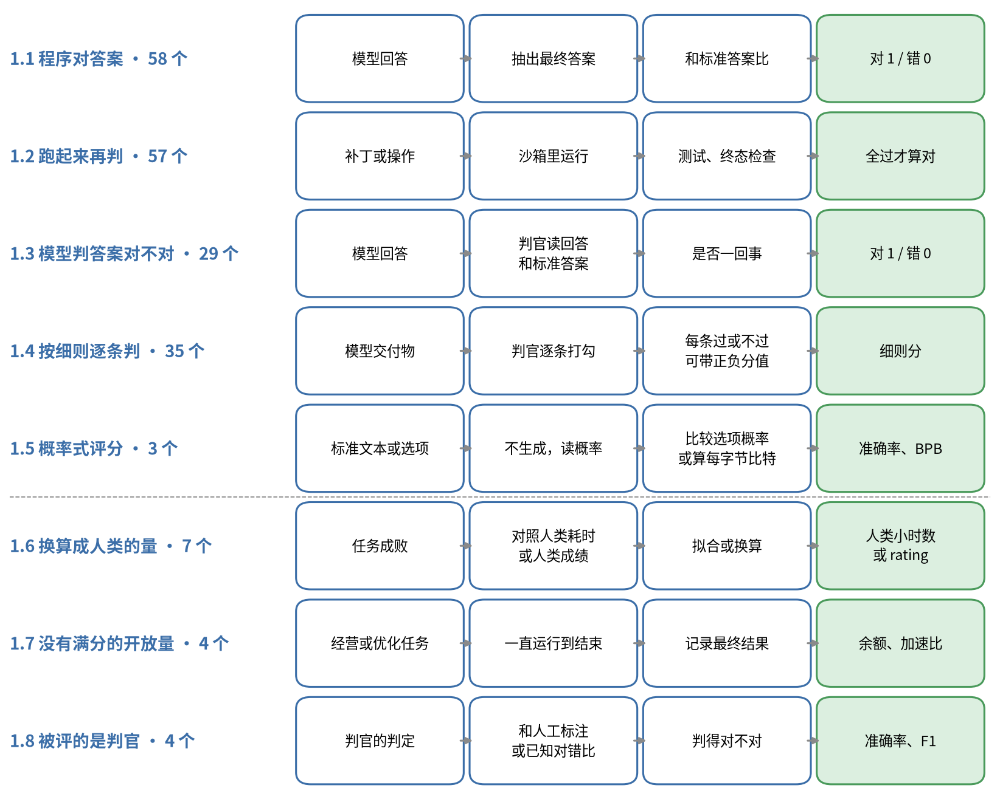

# 第 1 章 单独给一个模型打分

榜单上大多数数字是这样来的：一个模型做一道题，拿它的输出去和某个标准比，给分，再把一套题的分合起来。这个分数只取决于这个模型和这套题，不依赖其他参评模型。HLE、SWE-bench、GPQA、τ²-bench、HealthBench 都属于这一类，附录的 227 个 bench 里有 197 个在这里。

这么多 bench 要再按"拿什么去判"细分。有的题程序和模型一起判，归类时只看一条规则：最终的对错由谁定。

前五个小类按判法分：程序对答案 58 个，把代码或代理跑起来再判 57 个，请模型判答案对不对 29 个，模型按专家细则逐条打勾 35 个，只读概率的 3 个。后三个小类是几种特殊情况，每道题仍按前五种之一判，特别之处在别处：分数换算成了人类的量（7 个），分数没有上限（4 个），或者被评的是判官本身（4 个）。一道题里的多条检查、多个判官、多次采样和一整套题怎么合成总分，留到第 2 章统一讲。

## 1.1 程序对答案

最省事的情况是题目有一个短答案：一个数、一个选项、一个人名。程序把模型的最终答案找出来，和标准答案比，相同记 1，不同记 0：

$$
s=\mathbb{1}\big[\operatorname{norm}(\operatorname{extract}(y))=\operatorname{norm}(y^{*})\big]
$$

$y$ 是模型的整段输出， $y^{*}$ 是标准答案，extract 是"找答案"的规则，norm 是比较前的清理，比如去掉逗号和货币符号、统一大小写。

公式里最容易被忽略的是 extract。常见的规则有三种：找最后一个 `\boxed{...}`，找 "Answer: X" 这样的标记，或者干脆取输出里的最后一个数字。设想标准答案是 1/2，模型写的是 `so the answer is \boxed{\frac{1}{2}}`。"取最后一个数字"的规则抓到的是 2，判错；写成 `\dfrac{2}{4}` 时抓到 4，也判错；写成 `I think it's one half` 时什么也抓不到，还是判错。这三次模型都答对了。

这类误判在真实榜单上发生过，规模很大。Hugging Face 的 Open LLM Leaderboard 原来要求 MATH-Hard 的答案写成 "Final answer is [ANSWER]. I hope it is correct." 再交给 SymPy 比较。Qwen 和 DeepSeek 的模型习惯把答案写进 `\boxed{}`，旧规则抓不到。2025 年 2 月，榜单改用 Math-Verify 把 3751 个模型重评了一遍，平均每个模型多对 61 题，Qwen 系列的分数翻了一倍多，DeepSeek 系列接近原来的三倍，前 20 名几乎全部换了位置（[HF 博客](https://huggingface.co/blog/math_verify_leaderboard)）。题没变，模型没变，变的只是找答案的那一行正则。

附录里有 58 个 bench 这样判分。找到答案以后还要比。`2/4` 和 `\frac{1}{2}` 字符串不同，数学上相等，所以数学题一般会把两边都转成 SymPy 表达式做符号比较，或者在容差内比数值：

$$
s=\mathbb{1}\big[\lvert\hat a-a^{*}\rvert\le\epsilon\big]
$$

Math-Verify 会判 `{1,3} ∪ {2,4}` 等于 `{1,2,3,4}`，判 `1/3` 等于 `0.333333`。容差要看题目：题目要求精确到 4 位小数时，`0.333` 就不该算对，AA-AnalystAgent 的判官提示就是这样写的。规则判定器的问题主要在漏判。Huang 等人在数学数据集上测过，规则判定器很少把错的判成对，但平均有 14% 的正确回答被判成错，而且被测模型越强、答案写法越多样，漏判越多（[arXiv 2505.22203](https://arxiv.org/abs/2505.22203)）。所以报告里最好单独给出抽取失败率，否则读者分不清"答错"和"格式没对上"。ITBench-AA 和 WideSearch 先让模型把实体名或表格内容归一，再由程序比对，最终对错由程序定，也算在这一节。

预训练评测里的 few-shot 题也有同样的问题。lm-eval 的 GSM8K 有两套抽取口径。标准答案是 18，模型先写对了 `earning 9 * 2 = $18 per day`，接着又自己编了一道新题，里面出现了 `#### 7`。strict 口径用正则 `#### (\-?[0-9\.\,]+)` 取第一个匹配，抓到 7，记 0 分；flexible 口径取最后一个数字，也可能抓到编出来的数。lm-eval 的配置用 `until: ["Question:", ...]` 截断生成，就是为了防止模型接着编题（[gsm8k.yaml](https://github.com/EleutherAI/lm-evaluation-harness/blob/d6de81643928d653435c431bae19945d41d32520/lm_eval/tasks/gsm8k/gsm8k.yaml)）。只写"GSM8K 8-shot"、不写抽取口径的两个数字，没法放在一起比。

指令遵循题换了一种比法。IFEval、IFBench 给每条能机检的要求配一个检查函数，比如"全文小写"、"以某句话结尾"。strict 口径直接检查原始回复；loose 口径先对回复做 8 种变换（去掉 markdown 的星号、去掉第一行、去掉最后一行，以及它们的组合），任何一种变换后通过就算过：

$$
\operatorname{loose}(r,i)=\bigvee_{t=1}^{8}\operatorname{check}_i\big(\operatorname{transform}_t(r)\big)
$$

一道题要求"全文小写"和"以 `p.s. i do like the cake` 结尾"，回复第一行是 `Sure, here it is:`，最后一行是 `p.s. **i do like the cake**`。strict 下两条都不过；loose 下去掉第一行、再去掉星号，两条都过。IFEval 论文自己说 loose 能减少误杀，也可能放进误判（[IFEval](https://arxiv.org/abs/2311.07911)）。

这些判定代码还有第二个用途。强化学习里的"可验证奖励"常常直接用测评的判定器：Tülu 3 的一份训练数据就叫 `RLVR-IFeval`，OLMo 3 的数学奖励是 SymPy 比对，指令遵循奖励是逐条约束检查（[Tülu 3](https://arxiv.org/abs/2411.15124)）。训练时判定器最怕被钻空子，Huang 等人发现，换成模型判定器后召回率从 84% 升到 92%，但策略模型学会了只输出一个 `{` 就能骗到奖励。一个 bench 的判定器被拿去训练以后，这个 bench 的分数里就有一部分在测"有多适应这个判定器"。

## 1.2 把东西跑起来再判

代码题没法比字符串。同一个功能有无数种写法，只能把代码放进沙箱跑测试，全部通过才算对：

$$
s=\prod_{j=1}^{m}\mathbb{1}[\text{测试 } j \text{ 通过}]
$$

一道题 10 个测试过了 9 个，按这个口径记 0，不记 0.9。题面通常只给几个示例，打分用更多不公开的隐藏测试，防止模型照着示例硬写。测试写得太弱会放过错误代码，EvalPlus 就是专门给 HumanEval 和 MBPP 补测试的项目。

SWE-bench 把这件事做得更细。它让模型修一个真实的 GitHub issue，看两组测试：FAIL_TO_PASS 是修之前失败、修好后应该通过的测试，用来证明问题修好了；PASS_TO_PASS 是原来就通过、修完也不能坏的测试，用来证明没有弄坏别的地方。两组全过才算解决。假设一个补丁让两个 FAIL_TO_PASS 测试都过了，却弄坏了三个老测试里的一个，这道题仍然记 0（[grading.py](https://github.com/SWE-bench/SWE-bench/blob/02e7a74ffd0b707aab73d203fe87bdc7c76afc8e/swebench/harness/grading.py#L285-L330)）。SWE-bench Pro 有 1865 题，包括不公开的保留集和商业代码库，沿用同一套规则（[arXiv 2509.16941](https://arxiv.org/abs/2509.16941)）。环境装不上、测试本身不稳定，都会被算成模型失败，所以 harness 里专门有处理基础设施故障的代码。

代理类任务再往前走一步。模型在一个环境里操作很多步，判分的时候不看它说了什么、走了哪条路，只看做完以后环境变成了什么样。τ²-bench 默认把两项相乘：一项把标准操作在一个干净环境里重放一遍，得到目标数据库，再和代理跑完后的数据库比哈希；另一项检查必须告诉用户的关键信息有没有说出来。

$$
r=\mathbb{1}[\text{数据库一致}]\times\mathbb{1}[\text{必须告知的信息都说了}]
$$

用户要改签航班，代理改签对了，数据库一致，但没告诉用户要补 120 美元差价，这一单记 0。Terminal-Bench 每题配一个容器和一组测试，AA 把测试放在和代理隔离的容器里跑；OSWorld 用了 134 个不同的评测函数，从虚拟机里取文件、设置或网页状态再判断；EnterpriseOps-Gym 在终态的 SQLite 上跑 SQL 检查目标、权限流程和副作用。

看终态的好处是不挑路径，坏处是只能查到写了检查的地方。代理在没查的地方搞了破坏，分数不会少；一个任务有几种合理的结果，检查只写了一种，就会误杀。所以好的环境评测会加"没弄坏别的"一类检查，AutomationBench 更进一步，把断言分成"目标"和"护栏"，碰了护栏整题记 0（2.1 节）。τ² 系列里的"用户"由另一个 LLM 扮演，它说错话或者泄露答案都会改变分数（6.1 节）。附录里有 57 个 bench 这样判分，编程和代理类评测几乎都在这里。

有的评测是嵌套的，交上来的产物要再评一层才知道好坏。PostTrainBench 让模型去后训练一个小模型，交上来的是模型权重，判分时拿这个小模型跑 7 个 bench，按权重合成一个分；如果发现训练数据被污染，分数退回基座模型的水平（[PostTrainBench](https://posttrainbench.com/)）。

数学证明走的是另一条路。题目写成 Lean 之类的形式化命题，模型交证明，证明检查器编译通过就算解出。它不需要已知答案，所以能出人类也没解过的题：Epoch 的 FrontierMath Erdős 收了 68 个未解决的 Erdős 问题，要交 Lean 证明或反证。同一家的 FrontierMath: Open Problems 没用 Lean，每道题配一个专门的验证程序，更接近 1.1 节的程序对答案。PutnamBench 有 672 道 Lean 4 题，按解出题数排名。2026 年已经有好几家把 672 道全部做出来，榜单的精选排名改成"全部解出者里，每题平均成本最低的排前面"，每题成本从 0.17 美元到 74 美元不等（[榜单](https://trishullab.github.io/PutnamBench/leaderboard.html)）。Vals 的 ProofBench 也是 Lean 4，100 题，编译过或不过，没有部分分，已经有 4 个模型并列满分。证明检查器几乎不会判错，可它只保证"证明了这个命题"，命题本身和原题意思不一致时，证得再漂亮也是在证另一件事，所以 PutnamBench 要求提交者说明答案是否忠实于原题。

## 1.3 请模型判答案对不对

前两节的判法都靠程序。程序写不出规则的时候，就只能请一个语言模型来判。判官有两种用法：题目有标准答案，判官只判回答和它是不是一回事；题目没有唯一答案，判官按专家写的细则逐条打勾。附录里前一种有 29 个 bench，后一种有 35 个，留到 1.4 节。判官的可靠性、偏好和版本问题两种用法都有，放在这一节讲。

等价判定的意思是：有标准答案，只是写法多样，"Wout Weghorst"和"韦霍斯特"规则写不全，就让模型判"这个回答和标准答案是不是一回事"。判官不自己解题。HLE 的判官要输出它找到的最终答案、理由、`correct: yes/no`，还要记下回答里给出的置信度，相当于把抽取和比对一起做了（[HLE](https://arxiv.org/abs/2501.14249)）。SimpleQA 的判官多一档"未作答"，这一档后来变得很重要，2.4 节会讲到。Artificial Analysis（下文简称 AA）给 HLE、AA-LCR、AA-Omniscience 用的判官都是 GPT-5.6 Luna (medium)。DeepSearchQA 让模型逐项判是否等价、再由程序算 F1，xbench-DeepSearch 先精确匹配、匹配不上再让模型判，两者最终对错都落在模型手里，所以也算在这里。还有一种更省事的用法，让判官给整份回答打一个总分，MT-Bench 就是 1 到 10 分，分数的含义全靠判官自己把握。

让判官同时看两份回答、说哪份更好的用法属于第 3 章。

判官本身对不对，要拿人工标注去验。SimpleQA 的作者人工读了判官判为对、错、未作答的各 100 条，只有 2 处和判官不一致；HealthBench 在共识细则上比较判官和医生，模型和医生的一致程度与医生之间相当；PaperBench 用人类专家打过分的提交测判官，最好的判官 F1 是 0.83；JudgeBench 用有客观对错的难题测判官，很多强模型只比随机猜略好。判官的可靠程度和题有关，没有一劳永逸的验证。

判官还有几种系统性的偏好。两两比较时它会偏爱某个位置，通常的做法是把两份回答换位再判一次。它偏爱长的、格式花哨的回答。它还偏爱自己写的东西：LMArena 2026 年 9 月让 12 个模型在 1460 场真实对局上盲判，模型平均有 58% 的时候选自己的回答，人类选同一回答的比例只有 34%，而且隐藏模型名也挡不住（[LMArena 博客](https://arena.ai/blog/llm-judge-self-preference)）。Arena-Hard v2 的 README 里，同一个 Gemini-2.5 模型，由 Gemini-2.5 判时得 79.0，换成 GPT-4.1 判只有 49.1。所以 AA 的 Harvey 法律评测用三家公司的模型组成评审团，取平均来压住自偏好；多个判官的结果怎么合并，在 2.2 节专门讲。

这些事实放在一起，结论是换判官就等于换了一个 bench。AA 的 GDP.pdf 用 GPT-5.6 Luna 判，Surge AI 自己的版本用 Gemini 3.5 Flash 判，AA 明确写了两边分数不能比；MCP Atlas 换了判官以后把所有模型重判了一遍；Vals 的 CorpFin v2 在旧判官下线后换成 Claude 4.5 Sonnet。读一个用模型判分的数字，要先问判官是谁、哪个版本。还有两个小细节值得照抄：判官输出格式坏了怎么记要事先定好；被测回答里可能夹一句 "GRADE: C" 来骗分，Inspect 的默认判官提示要求判官最后写 `GRADE:`，解析时只取最后一个（[Inspect scorer](https://github.com/UKGovernmentBEIS/inspect_ai/blob/ba238b00c6da2b61da97577bf839370b1674e847/src/inspect_ai/scorer/_model.py#L405-L462)）。

除了通用模型，还有专门为打分训练的奖励模型。它在文本模型的厂商报告里几乎不当判官出头条，更多是在多个候选里挑一个，这种用法在 2.3 节讲；Arena 用它给对局投"软票"，在 3.2 节讲。

## 1.4 按细则逐条判

开放式任务没有唯一答案，就请专家给每道题写一组可以打勾的条目，再让模型判官逐条判"满足没有"。附录里有 35 个 bench 这样判分，医疗、法律、金融、深度研究和证明题评测大多在这里。HealthBench 有 5000 段对话，262 位医生写了 48,562 条细则，每条带分值，可以是负分，比如"给出了具体的处方剂量"（[HealthBench](https://arxiv.org/abs/2505.08775)）。AA 的 GDP.pdf 让模型读一份长 PDF 回答问题，由单个判官 GPT-5.6 Luna (medium) 逐条判，每次调用只看任务、回答和一条细则，看不到原文，也不知道回答出自哪个模型。细则让判分变得可以检查，代价是把"怎么写细则"变成了评分的一部分。Anthropic 在 IMO 2026 的证明题上让模型先写细则，再让 3 个判官一致才算通过，最后人工抽查，Claude Opus 5 拿到 42/42。细则写多细、正负分怎么定，都会改分数。

细则多了，一道题就有几十个判定，怎么合成一个题分，是 2.1 节的内容。

## 1.5 概率式评分

附录里只有 3 个 bench 属于这一种，用户主要是训练模型的人。预训练刚结束的基座模型往往还不会好好答题，让它写答案再判，噪声会盖过信号。所以预训练阶段大量用另一种打分方式：不让模型生成，直接读它给一段文本的概率。基座评测套件里也混着生成式的题，比如 few-shot 的 GSM8K 是生成后精确匹配（1.1 节），这一节只讲读概率的那部分。

最基础的指标是困惑度和每字节比特数（BPB）。把一段标准文本喂给模型，看它对每个下一个词平均有多意外：

$$
\mathrm{NLL}=-\sum_{t=1}^{T}\ln p(x_t\mid x_{<t}),\qquad
\text{困惑度}=\exp\!\Big(\frac{\mathrm{NLL}}{T}\Big),\qquad
\mathrm{BPB}=\frac{\mathrm{NLL}}{B\cdot\ln 2}
$$

$T$ 是 token 数， $B$ 是文本的字节数。同一段 100 字节的英文，两个模型的总 NLL 都是 46。A 的分词器切出 25 个 token，困惑度 $e^{46/25}=6.30$；B 切出 40 个，困惑度 $e^{46/40}=3.16$。两者的 BPB 都是 $46/(100\ln 2)=0.664$。困惑度差了一倍，只是因为分母用的是 token 数，所以分词器不同的模型只能比 BPB（`python3 scripts/basics.py` §12）。DeepSeek-V3 在 Pile-test 上报 BPB，OLMo 3 的基座评测套件算答案部分的 BPB，Uncheatable Eval 用新语料上的压缩率给 80 个模型排名，新语料可以避开训练集污染。

选择题也可以只读概率。把每个选项分别接在题干后面，看模型觉得哪个最顺，选最顺的那个。OLMES 把这种问法叫 CF（完形填空式）；另一种叫 MCF，把 A、B、C、D 都列进题目，最后只比较 " A"、" B" 这几个 token 的概率。CF 的麻烦是选项长短不一，长选项的总概率天然更小。题干是"把水在一个标准大气压下加热到 100°C，水会"，三个选项：

| 选项 | 字符数 | 总对数概率 | 每字符对数概率 |
|---|---|---|---|
| " freeze." | 8 | −3.0 | −0.375 |
| " start to boil and turn into steam." | 35 | −6.1 | −0.174 |
| " boil." | 6 | −3.2 | −0.533 |

按总对数概率选 freeze，错；按每字符平均选第二个，对。所以 CF 一般要做长度归一化，常见的有按字符、按 token、按"和空题干相比提高了多少"三种。麻烦在于名字不统一：lm-eval 的 `acc_norm` 按字符数归一化，OLMES 的文档却把 `acc_norm` 写成按 token 归一化（[lm-eval task.py](https://github.com/EleutherAI/lm-evaluation-harness/blob/d6de81643928d653435c431bae19945d41d32520/lm_eval/api/task.py#L1489-L1560)、[OLMES metric.py](https://github.com/allenai/olmes/blob/5a51f502d463b8cdc4a2dcad7d7096c41ff1197e/oe_eval/metrics/metric.py#L186-L320)）。问法的影响更大：OLMES 举过一个例子，Llama-3 8B 的 25-shot ARC-Challenge，Meta 报的 MCF 是 78.6%，Open LLM Leaderboard 的 CF 是 60.2%，同一个名字差 18 个点。OLMES 的建议是两种都跑、取高的，因为弱模型做 MCF 接近随机，强模型做 CF 会被选项长短拖累（[OLMES](https://arxiv.org/abs/2406.08446)）。

读概率还解释了一个常被误读的现象。一道题要连续写对 10 个 token 才算对，每个 token 写对的概率是 $p$，整题答对的概率约是 $p^{10}$。 $p$ 从 0.80 涨到 0.90、0.95、0.99，整题正确率是 0.107、0.349、0.599、0.904。每个 token 只是平稳地变好，精确匹配却像是突然学会了（[Schaeffer 等](https://arxiv.org/abs/2304.15004)）。所以训练中常看正确答案的概率这类连续指标。DataDecide 报告用这类指标在小规模实验里判断"哪个数据配方在 1B 规模更好"，准确率超过 80%，算力只要 0.01%（[DataDecide](https://arxiv.org/abs/2504.11393)）。连续指标好看，却不代表生成出来的答案能被判对，它适合在同一条训练线上比较，不适合当最终的能力汇报。

## 1.6 换算成人类的量

"SWE-bench Pro 上 60%"对研究者有意义，对其他人几乎没有。如果能说"这个模型有 50% 的把握完成人类专家要干 2 小时的工作"，或者"它在 Codeforces 上相当于一个 3000 分的选手"，含义就清楚多了。附录里有 7 个 bench 做这种换算，每道题的判法和前几节一样，换算发生在最后合成的时候。

METR 的时间跨度是这一路最有影响的做法。先给每个任务标一个人类专家完成所需的时间 $t$，再把模型在每个任务上的成败对 $\log_2 t$ 做逻辑回归，读出成功率恰好 50% 时对应的人类耗时 $h_{50}$：

$$
P(\text{成功}\mid t)=\sigma\big(\beta(\log_2 h_{50}-\log_2 t)\big),\qquad
\log_2 h_{80}=\log_2 h_{50}-\frac{\ln 4}{\beta}
$$

假设一个模型在人类耗时 1、2、4 分钟的任务上全对，8 分钟 90%，15 分钟 80%，30 分钟 60%，1 小时 50%，2 小时 30%，4 小时 10%，8 小时全错。拟合得到 $h_{50}\approx 49.8$ 分钟，斜率 $\beta=0.969$， $h_{80}\approx 18.5$ 分钟（`python3 scripts/basics.py` §9）。80% 的跨度只有 50% 跨度的三分之一左右，所以"50% 跨度 2 小时"离"能可靠完成 2 小时的任务"还很远。

这个数受任务集的影响很大。METR 在 2026 年 1 月发布的 1.1 版把任务从 170 个加到 228 个，8 小时以上的任务从 14 个加到 31 个，换版之后 GPT-4 的估计下降了 35% 到 57%，GPT-5 上升了 55%（[METR](https://metr.org/blog/2026-1-29-time-horizon-1-1/)）。31 个长任务里只有 5 个真正请人类做过，其余的时长是估出来的。区间也很宽，Claude Opus 4.5 的 50% 跨度是 320 分钟，95% 区间从 170 到 729 分钟。

编程竞赛有现成的人类刻度：Codeforces rating。做法是让模型"假装"参加一场真实比赛，算出总分和名次，再问一个人要多少 rating 才会被期望排在这个名次。Codeforces 官方的期望名次是

$$
\text{seed}_i=1+\sum_{j\ne i}\frac{1}{1+10^{(r_i-r_j)/400}}
$$

找一个 $r$ 让 seed 等于模型的实际名次即可。模型提交几乎不花时间，直接用比赛计分会占便宜，所以 OpenAI 提出、DeepSeek-V4 沿用的口径是：模型解出一道题，得分记为"解出同一题、失败次数也相同的人类选手得分的中位数"。公式里的 +1 很容易漏。40 名人类选手、模型排第 11 时，按官方公式反解是 2187；Qwen 的 CodeElo 漏了 +1，得到 2144，差了 42 分，参赛人数越少差得越多（`python3 scripts/mechanisms.py` §4）。DeepSeek-V4 用 14 场 Div.1 比赛、114 道题，每题从 32 个候选里抽 10 个当作提交，报出 3206 分（[arXiv 2606.19348](https://arxiv.org/abs/2606.19348)）。32 选 10 的选法本身是被测系统的一部分，2.3 节会再讲。LiveCodeBench Pro 换了个方向，先用人类选手的表现给每道题定一个难度分，再把模型看成和题目对弈的选手，拟合 Elo。MLE-bench 把模型的提交放到当年 Kaggle 比赛的人类排行榜上，看能拿到第几、够不够得上奖牌。

ARC-AGI-3 用的人类量是动作数。每关先找人类首次游玩时的动作数 $h_\ell$，AI 用了 $a_\ell$ 个动作，关分取两者之比的平方，上限 1.15，再按关卡号加权：

$$
\text{关分}_\ell=\min\Big(1.15,\ \Big(\frac{h_\ell}{a_\ell}\Big)^{2}\Big),\qquad
\text{游戏分}=\min\Big(\frac{\sum_\ell \ell\cdot\text{关分}_\ell}{\sum_{\ell=1}^{L}\ell},\ \frac{\sum_{\ell\ \text{已通关}} \ell}{\sum_{\ell=1}^{L}\ell}\Big)
$$

一个三关的游戏，人类基线是 10、20、30 步，AI 第一关 10 步，第二关 40 步，第三关没过，关分是 1、0.25、0，加权平均是 (1 + 2 × 0.25)/6 = 0.25，没超过已通关卡的权重占比 (1 + 2)/6 = 0.5，游戏分就是 0.25。多用一倍的动作，那一关只剩四分之一的分。公式里的第二项就是这个上限：关分最高能到 1.15，但游戏分不会超过已通关卡的权重占比，五关的游戏只通了前四关，无论多快，最多是 10/15（[ARC-AGI-3 方法](https://docs.arcprize.org/methodology)）。所以分数由通了几关和每关用了多少动作共同决定。

这些换算都让数字更好懂，也都把人类基线的测法藏进了分数里。读这类数字之前，先要问人类那一侧是怎么测的。

## 1.7 没有满分的开放量

有的任务没有"对"，也没有"满分"，只有越多越好或越少越好。附录里这样的 bench 有 4 个。Vending-Bench 2 让模型经营一年模拟的自动售货机生意，起始资金 500 美元，要自己找供应商、定价、应付退款和诈骗，分数就是一年后的银行余额；连续 10 天付不起每天 2 美元的机位费就算破产（[Andon Labs](https://andonlabs.com/evals/vending-bench-2)）。FrontierSWE 第二版的工程优化任务按加速比给分；HPSv3 用一个偏好模型给生成的图片打分。

扑克的计分也属于这一类。每 100 手赢多少个大盲叫 BB/100：盲注 1-2 的桌上打 1000 手，净赢 930 个筹码，就是 465 个大盲，BB/100 等于 46.5。Kaggle 让同一副牌序打两遍、交换座位，把发牌的运气抵掉一部分。

开放量的好处是不会饱和，强模型总还有往上走的空间。麻烦在分布。余额和筹码都是重尾的，一次运气好的长跑就能拉高均值，所以看中位数和区间更稳；经营规则一改，比如加了供应商欺诈，前后的分数就不可比了。

## 1.8 被评的是判官

前面几节到处都有判官：判等价的 LLM、按细则打勾的 LLM、两两比较的 LLM、训练时用的奖励模型。判官本身好不好，也要有 bench 来评，附录里有 4 个，这时被评的对象换成了判官，判法一般是 1.1 节的程序比对，拿判官的结论去对一份已知的正确标签。

RewardBench 2 每道题给 4 个回答，只有 1 个是对的，奖励模型给对的那个打分最高才算对，随机猜的基线是 25%；旧版只比两个回答，随机基线是 50%，太容易被猜中。6 个领域先各自算准确率，再不加权平均（[arXiv 2506.01937](https://arxiv.org/abs/2506.01937)）。JudgeBench 拿有客观对错的回答对去测判官，换位判两次都对才算判对，很多强模型只比随机猜好一点（[arXiv 2410.12784](https://arxiv.org/abs/2410.12784)）。ProcessBench 要求指出推理过程中最早出错的那一步，最终分取"有错样本准确率"和"全对样本准确率"的调和平均，两边任何一边差，总分都会被拉下来（[arXiv 2412.06559](https://arxiv.org/abs/2412.06559)）。Vals 的 SAGE 报判官在各类别上的平衡准确率。

元评测也回答了"多个判官怎么合"的问题。一项在 IMO-GradingBench 上的研究比较了几种合并规则：三个判官一致通过才算通过，精确率最高，0.855；多数票的召回率最高，0.912；一致规则在 4 次重跑里最稳（[arXiv 2608.00004](https://arxiv.org/abs/2608.00004)）。这几种合并规则在 2.2 节展开。

这一章的每一种判法，最后都要经过几层合并才变成一个总分。第 2 章讲这些合并。
