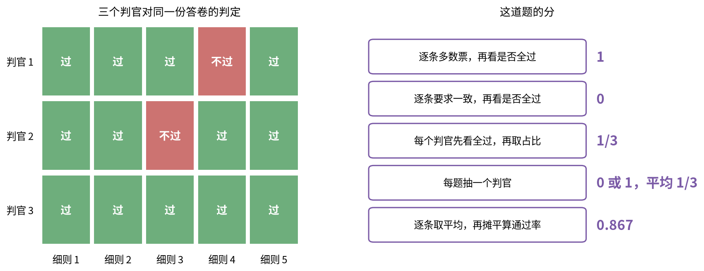
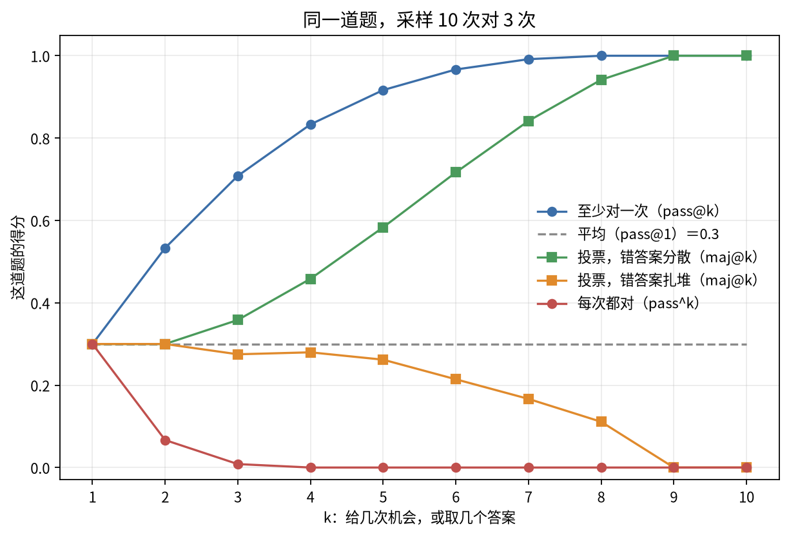

# 第 2 章 合并：从一条判定到一个总分

第 1 章的每一种判法，给出的都是一个个零散的判定。变成榜单上的一个数，还要经过四层合并：一道题里的多条检查合成题分，几个判官的意见合成一个判定，同一道题的几次采样合成一个数，一整套题合成总分。

沿哪个维度合、先合哪一层，都会改变结果。HealthBench 的单题分可以是负的，它先在全集上平均，平均完才裁到 0 到 1。两道题，题分 −0.4 和 0.8，先平均再裁剪是 0.2；先把每题裁到 0 到 1 再平均，负分被抹平，变成 0.4。判官和细则的先后也一样，2.2 节有一个例子，同一份判定按不同顺序合出 1、0 和 1/3。下面从里往外，一层一层讲。第 3 章的对局拟合也是一种合并，放在那里讲。

## 2.1 一道题里的多条检查

一道题里常常有很多条检查：几十条细则，几十个测试，τ²-bench 的数据库和告知两项检查。合成的做法有好几种，给出的数字可以差几倍。

最直接的两种是全过和比例：全部通过才给 1，或者通过多少给多少。合到整套题时又有两种平均：把所有细则摊平了算通过率（微平均），或者先在每道题内算通过率、再对题平均（宏平均）。

$$
\text{微平均}=\frac{\sum_t\sum_{c\in t}y_{tc}}{\sum_t\lvert t\rvert},\qquad
\text{宏平均}=\frac{1}{T}\sum_t\frac{1}{\lvert t\rvert}\sum_{c\in t}y_{tc},\qquad
\text{全过率}=\frac{1}{T}\sum_t\prod_{c\in t}y_{tc}
$$

算一个最小的例子。两道题，第一道 10 条细则过了 9 条，第二道 2 条过了 0 条。微平均是 9/12 = 0.75，宏平均是 (0.9 + 0)/2 = 0.45，全过率是 0。同一份判定，从 0.75 到 0（`python3 scripts/basics.py` §11）。真实榜单上的差距一样大：Vals 的 Legal Research Bench 在同一张榜上并列 all-pass 55.29 和加权通过率 90.58；Vals Finance Agent 同时报两种口径，名次会翻转。全过口径很陡，差一条和差二十条都是 0，而且非常依赖判官在边界情况上怎么判；只报全过、不报比例，读者分不清"差一点"和"差很多"。

细则可以带分值。HealthBench 的题分是满足条目的分值和除以正分值总和：

$$
s_i=\frac{\sum_c \mathrm{pts}_c\cdot\mathbb{1}[\mathrm{met}_c]}{\sum_{c:\,\mathrm{pts}_c\gt 0}\mathrm{pts}_c}
$$

一道题有四条细则：+5"建议立即就医"、+3"询问症状持续多久"、+2"表达简洁"、−4"给出具体处方剂量"。回答满足了 +5 和 +2，也犯了 −4，题分是 (5 + 2 − 4)/(5 + 3 + 2) = 0.3。单题分可以是负数，所以裁剪的先后很要紧，本章开头算过。

细则还可以排成一棵树。PaperBench 让模型复现 ICML 论文，每篇论文一棵评分树，叶子是能判过或不过的具体要求，父节点是子节点的加权平均，一共 8316 个叶子。根节点下有 A、B、C 三个子节点，权重 3、1、2；A 的两个叶子一过一不过，得 0.5；B 得 1；C 的两个叶子权重 2 和 1，只过了权重 1 的那个，得 1/3。根节点 = (3 × 0.5 + 1 × 1 + 2 × 1/3)/6 = 0.528（[PaperBench](https://arxiv.org/abs/2504.01848)）。

答案是一组东西时，要决定漏报和多报各扣多少。记提交的集合为 $S$、标准集合为 $G$：

$$
P=\frac{\lvert S\cap G\rvert}{\lvert S\rvert},\qquad R=\frac{\lvert S\cap G\rvert}{\lvert G\rvert},\qquad F_1=\frac{2PR}{P+R}
$$

DeepSearchQA 和 GraphWalks 用 F1，漏报多报都扣，有召回就有分；VoiceCodeBench 要求一段录音里的实体全对才算对；AA 的 ITBench 用第三种，叫"全召回下的精确率"：漏一个就是 0，一个不漏时才看多报了多少。ITBench 的任务是找 Kubernetes 故障的根因。设两个根因组 {svc-a, pod-a-1}（后者是前者的别名）和 {db}，另有一个不是根因的 svc-b。几种提交的得分如下（`python3 scripts/mechanisms.py` §6）：

| 提交 | F1 | 全召回下的精确率 |
|---|---|---|
| 只报 svc-a | 0.667 | 0 |
| svc-a、db | 1 | 1 |
| svc-a、db、svc-b | 0.800 | 0.667 |
| 撒网报 6 个 | 0.500 | 0.333 |

只报一个根因，F1 还有 0.667，全召回精确率直接是 0；报全以后，多报一个的惩罚又比 F1 重。根因排查漏掉一个就修不好，这个评测选了更狠的那种。

连续分也可以切一条线变成对错。MCP Atlas 的每个要点按 1、0.5、0 判，覆盖率达到 0.75 算通过；Remote Labor Index 评级达到 2 算达标；DrugDiscoveryBench 必须拿满 100 分。线放在哪是人定的，离线很近的两个模型会被硬切成 0 和 1。

还有一种规则更硬：某个条件一触发，整题清零，不管别的部分做得多好。AutomationBench 碰了护栏记 0；AA 的 Harvey 法律评测里，交付物有一处实质性幻觉，这道题就记 0。查幻觉分两步，一个判官先列出可疑的陈述并引证，另一个判官（GPT-6 Sol high）对照原始材料逐条维持或驳回。MLCR-AA 的回答超过参考答案 5 倍长直接记 0；FrontierCode 违规联网的那次记 0。门控把"不许做的事"放在了比"做对多少"更高的位置。它和全过一样陡，而且门控条件常常由另一个判官判，那个判官判错一次，整道题就是 0。

最后一种是换刻度。Vals 的 RSI Index 把每道题的原始指标换算到"起点 = 0、人类或已发表的参考结果 = 0.5、理论最优 = 1"的刻度上。基线和参考选谁，0 和满分就落在哪里，换基线等于换尺子。

这些规则可以叠着用。AA 的 Harvey 法律评测同时用了三层：三个判官各自逐条判；每个判官看自己是不是判了全部细则通过；一道题的分是"判全过的判官占几成"，可能是 0、⅓、⅔ 或 1；有实质幻觉再清零。读这种数字，先把这几层拆开，再去比大小。

## 2.2 多个判官

第 1 章说过，单个 LLM 判官会出错，会偏爱自家模型，于是越来越多的评测请好几个判官。判官多了，就得决定意见不一致时听谁的。现在在用的规则有六种。

最常见的是取平均。Harvey 的法律评测每条细则让 3 个判官判，取通过的比例，所以单条细则的分只可能是 0、⅓、⅔ 或 1；FACTS Grounding 的事实分是 3 个判官分数的平均。第二种是多数票，MLCR-AA 让 3 个判官分别就准确性和完整性投票。第三种要求一致，Anthropic 在 IMO 2026 证明题上要求 3 个判官都同意才算通过。第四种是同一个判官判几次取众数，Vals 的金融 agent 评测就这样做。第五种是单侧覆盖，AA-AnalystAgent 让 LLM 判完之后再用程序做数值检查，程序只能把"错"改成"对"，不能反过来。第六种是每一场从判官池里抽一个，GDPval-AA 和 AA-Briefcase 都这样做，再用 Crowd-BT 的可靠度吸收判官之间的差异（3.4 节）。Briefcase 固定"同一条细则永远由同一个判官判"，否则判官的噪声会混进模型之间的比较。

这些规则对同一份判定会给出不同的答案。一个任务有 5 条细则，三个判官里，判官 1 判第 4 条不过，判官 2 判第 3 条不过，判官 3 全判通过：

逐条多数票的结果是五条全过，这道题算通过；要求一致的话，第 3、4 条不过，这道题不通过。Harvey 的头条先在每个判官内部看是否全过，再对判官取比例：

$$
s_{\text{题}}=\frac1K\sum_k\prod_c v_{kc}
$$

只有判官 3 判了全过，这道题得 ⅓。同一份答卷，"全过"可以是 1、0 或 ⅓（`python3 scripts/mechanisms.py` §5）。所以报分时，"先合判官再看全过"还是"先看全过再合判官"，要写清楚。

偏差和方差也不同。做一个模拟：100 道题，真实通过率 0.60，每个判官独立地以 15% 的概率判错，重复 4000 次：

| 规则 | 均值 | 标准差 |
|---|---|---|
| 单个判官 | 0.569 | 0.0357 |
| 三个判官取平均 | 0.570 | 0.0205 |
| 三个判官多数票 | 0.588 | 0.0238 |
| 三个判官须一致 | 0.369 | 0.0379 |

取平均和单个判官的偏差一样，标准差小了近一半；多数票离真值最近；一致规则在判官对称犯错时严重偏低（`python3 scripts/mechanisms.py` §5）。一致规则适合"判官更容易错放、不容易错杀"的场合，它用召回率换精确率，1.8 节那项证明评分研究里，一致规则的精确率最高，多数票的召回率最高。

最后要分清两种投票。同一个判官判三次取众数，是对判定投票；maj@k 是对被测模型的答案投票。2.3 节有一道采样 10 次对 3 次、错答案各不相同的题，对答案投票得 1，对 10 个"对/错"判定取众数是 3 对 7 错，得 0。Inspect 框架里叫 mode 的合并做的是后者，名字相近，结果相反。

## 2.3 同一道题跑多次

模型的输出有随机性，同一道题问两次，答案可能不同。于是常见的做法是每题跑 $n$ 次，其中 $c$ 次答对。下面一直用一个例子：一道题跑了 10 次，对了 3 次。

最朴素的做法是取平均，这道题记 3/10 = 0.3，再在所有题上平均，叫 pass@1，也有人叫 avg@k 或 mean@k：

$$
\text{pass@1}=\frac{1}{N}\sum_{i=1}^{N}\frac{c_i}{n}
$$

三道题分别对了 9、3、0 次，pass@1 就是 (0.9 + 0.3 + 0)/3 = 0.40。跑多少次不改变期望，只改变抖动。DeepSeek-R1 发现长推理模型用贪心解码会重复、在检查点之间大幅波动，于是改用温度 0.6 采样，AIME 和 GPQA 每题采 64 次再平均。AIME 一年只有 30 道题，单次运行的标准差可达 5 到 15 个百分点，采样再多，也消不掉"题目只有这 30 道"带来的那部分噪声，这一点留到 6.3 节。

有的场景更关心上限。写代码时可以多试几次，只要有一次通过测试就行，这时问的是"给 $k$ 次机会，至少对一次的概率"，叫 pass@k。直觉的算法是把 $\hat p=0.3$ 代进 $1-(1-\hat p)^k$，但这相当于有放回抽样，会系统性偏低。Codex 论文给出的无偏估计是：从 $n$ 次结果里不放回地挑 $k$ 个，算"全挑到错的"概率，再用 1 减：

$$
\text{pass@}k=\mathbb{E}_i\left[1-\frac{\binom{n-c_i}{k}}{\binom{n}{k}}\right]
$$

客服和数据分析正好相反，一次出错就要人工复核，这时关心的是"连做 $k$ 次全对"的概率。τ-bench 为此提出了 pass^k：

$$
\text{pass}^k=\mathbb{E}_i\left[\frac{\binom{c_i}{k}}{\binom{n}{k}}\right]
$$

同一道 3/10 的题，几种算法的结果相差悬殊（`python3 scripts/basics.py` §1）：

| | pass@1 | pass@2 | pass@5 | pass^2 | pass^3 |
|---|---|---|---|---|---|
| 组合数估计 | 0.3 | 0.5333 | 0.9167 | 0.0667 | 0.0083 |
| 代入 $\hat p$ | 0.3 | 0.51 | 0.8319 | 0.09 | 0.027 |

pass@2 和 pass^2 差了 8 倍。只对了 3 次，pass^5 就是 0，pass@5 却超过 0.9。pass@k 随 $k$ 单调上升，拿别人的 pass@1 去比自己的 pass@64 是不公平的；pass^k 随 $k$ 塌得很快，不写 $k$ 就没法读。同一个 bench，由不同的人来跑，合并方法也可能不同：τ³-Banking 在 AA 那里是 97 题各跑 5 次、报平均，在 Sierra 的原论文里报 pass^k，两边的数不能放在一起比。

分数是连续的时候没法数"对了几次"，就取最差或最好的那一次。HealthBench 的 worst-at-k 取 $k$ 个回答里细则分最低的那个，相当于连续分版本的 pass^k。FrontierSWE 第二版的柱子画平均，须线从最差画到最好。

另一类合并发生在判对错之前。maj@k 先对 $k$ 个答案投票，票数最多的作为最终答案，再判对错：

$$
\text{maj@}k=\frac{1}{N}\sum_i\mathbb{1}\big[\mathrm{mode}(a_{i,1},\dots,a_{i,k})=y_i\big]
$$

某题 8 个答案是 42、42、17、42、17、17、17、9，正确答案是 42。17 有四票，42 只有三票，maj@8 = 0；同一组采样，平均是 0.375，pass@8 是 1。回到 3/10 那道题，正确答案是 1/2：如果 7 个错答案里有 5 个都是 1/3，1/3 胜出，maj@10 = 0；如果错答案五花八门、各只一票，1/2 以 3 票胜出，maj@10 = 1。pass@1 都是 0.3，maj@10 取决于模型是"一致地错"还是"随机地错"。投票要在等价判定之后做，1/2、0.5 和 2/4 应该算同一票。

把这道 3/10 的题画成随 $k$ 变化的曲线，几种算法的走向一目了然。投票的两条曲线是从这 10 个答案里不放回地取 $k$ 个、平票时随机选一个算出的期望：

选择器更进一步。生成 $N$ 个候选，让奖励模型、测试用例或别的规则挑出一个，再判挑出来的那个对不对。选择器要是就是标准答案，它就等于 pass@N；随机挑一个，等于 pass@1；有偏的选择器，比如偏爱长答案的奖励模型，可以比 pass@1 还差。OpenAI 的 o1-ioi 在 Codeforces 上，加入测试筛选之后 rating 从 1807 涨到 2092，再到 2214；DeepSeek-V4 每题生成 32 个候选、抽 10 个当提交（1.6 节）。maj@k 和选择器评的都是"模型加上一套挑选办法"这个系统，报分时要和挑选办法一起报。

## 2.4 整套题合成一个分

题分有了，最常见的做法是平均： $\frac1N\sum_i s_i$。大多数榜单就停在这里。但"会不会答"和"敢不敢答"混在同一个平均里，会奖励硬猜。这一节讲几种为此做的改动。

SimpleQA 的判官给三档：对、错、未作答。全集上可以算三个数：

$$
\text{correct}=\frac{\#\text{对}}{N},\qquad
\text{cga}=\frac{\#\text{对}}{\#\text{对}+\#\text{错}},\qquad
F=\frac{2\cdot\text{correct}\cdot\text{cga}}{\text{correct}+\text{cga}}
$$

100 题里 40 对、20 错、40 没答，correct 是 0.40，cga 是 40/60 = 0.667，F 是 0.50。论文自己指出 F 分数有漏洞：表现低于一半时，只要有一半把握就该去猜（[SimpleQA](https://arxiv.org/abs/2411.04368)）。堵住漏洞的办法是答错扣分、不答零分。AA-Omniscience 就这样算：

$$
\text{OI}=100\cdot\frac{\#\text{对}-\#\text{错}}{N}
$$

两个模型各答 100 题。M1 对 60、部分对 5、错 30、不答 5；M2 对 45、部分对 5、错 5、不答 45。按准确率 M1 领先（0.60 对 0.45），按 OI 是 M2 领先（40 对 30）。永远不答的模型 OI 是 0，全答错是 −100。AA 指数没有直接用 OI，而是拆成准确率和"1 − 幻觉率"两项，幻觉率的分母是没答对的题。所以准确率很高的模型幻觉率也可以很高，它不会的那几道全在硬猜（[AA-Omniscience](https://arxiv.org/abs/2511.13029)）。

HLE 走的是另一条路：让模型对每道题报一个置信度，看它说有九成把握的题是不是真对了九成。按置信度分箱，算每箱平均置信度和实际准确率的差：

$$
\mathrm{RMSCE}=\sqrt{\sum_k\frac{\lvert B_k\rvert}{n}\big(\overline{\text{conf}}_{B_k}-\overline{\text{acc}}_{B_k}\big)^2}
$$

20 道题，10 道报 90% 实际对了 6 道，10 道报 50% 实际对了 5 道，RMSCE = $\sqrt{0.5\times0.3^2+0.5\times0^2}=0.212$。一个总报低置信度的模型，在几乎全错的题库上校准误差反而小，所以校准误差要和准确率一起看。

平均也可以加权。PolyMath 按难度加权，四档难度的权重是 1、2、4、8，难题一道顶简单题八道。

总分算完，名次还可以另定。Scale 的 SEAL 榜规定：名次 = 1 + 置信区间下界高于本模型区间上界的模型数。两个模型分数不同，但区间重叠，就可以并列同一名。SEAL 的名次回答的是"有几个模型显著比你强"，分数高一点不一定名次高。误差区间本身怎么算，在 6.3 节讲。

这两章的分数都只看一个模型自己的答卷。前提是能说清什么算对，或者至少能写出细则。写诗、写网页、陪人聊天，很难写出一份所有人都认的细则，人们就改问两份产出哪份更好。这是第 3 章的内容。
