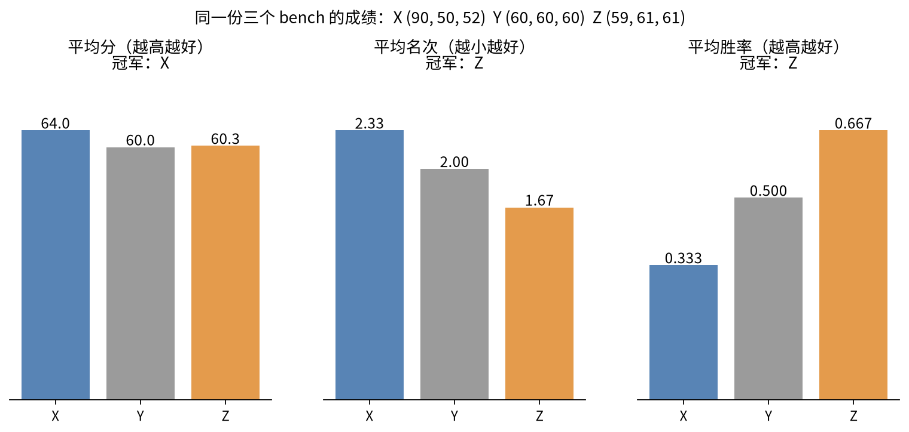

# 第 5 章 跨 bench 合成指数

前面几章的分数都出自一个 bench。模型发布时会报几十个，读者想要一个数。综合指数是对前面那些分数的再汇总，它自己不出题，唯一属于自己的部分就是怎么合。附录收了 8 个这样的指数。

Artificial Analysis 的智能指数是最常被引用的一个。当前版本有四大类十个组件：Agents 占 30%（AA-Briefcase 15%、GDPval-AA 10%、AutomationBench-AA 5%），编程占 20%（Terminal-Bench 4.0 和 SciCode 各 10%），通用占 30%（AA-Omniscience 15%、GDP.pdf 10%、AA-LCR 5%），科学推理占 20%（HLE 和 CritPt 各 10%）。指数就是加权和乘以 100：

$$
\text{Index}=100\times\sum_k w_k\,x_k,\qquad \sum_k w_k=1
$$

两个 Elo 类组件要先压到 0 到 1，用的是

$$
\mathrm{norm}(\text{Elo})=\mathrm{clamp}\Big(\frac{\text{Elo}-500}{2000},\,0,\,1\Big)
$$

Elo 1100 对应 0.30，1600 对应 0.55，2600 以上一律是 1。一个虚构模型：Briefcase 1300（0.40）、GDPval-AA 1600（0.55），其余八项依次是 0.50、0.40、0.45、0.50、0.60、0.30、0.70、0.30、0.10，按权重加起来是 0.41，指数 41（`python3 scripts/basics.py` §10）。归一化区间决定了组件的实际分量：Elo 每涨 100 分，组件分只涨 0.05，在没碰到上下限时只给指数加 $5\times w$ 分，权重 15% 就是 0.75 分。3.8 节说过，这两项的 Elo 在模型进入指数时就冻结了。AA 明说权重偏向 agent 任务，指数的版本号一变，组件、判官、锚点都可能跟着变，跨版本不能比（[AA 方法页](https://artificialanalysis.ai/methodology/intelligence-benchmarking)）。

权重是编辑的选择，也就是一种价值判断。Vals Index 把这一点摆到了明面上，按各行业在美国 GDP 中的占比加权。

另一条路是让数据自己决定权重。Epoch 的 ECI 把每个 bench 当成一道"大题"，有难度 $D_b$ 和斜率 $\alpha_b$，每个模型有一个能力 $C_m$：

$$
\text{score}(m,b)=\sigma\big(\alpha_b(C_m-D_b)\big)
$$

这就是项目反应理论，只是题目换成了 bench。只要模型之间在部分 bench 上有重叠，所有模型就能放到同一把尺子上，某个 bench 已经饱和、新模型没测过也能比。三个模型的能力是 0、1、2.5，三个 bench 的难度是 −1、1、3，斜率是 2、1.5、1。能力为 0 的模型没测过最难的 bench，模型预测它只能拿 0.047；能力为 2.5 的模型没测过最简单的 bench，预测是 0.999，已经饱和。同样的能力差，在不同的 bench 上对应完全不同的分数差。ECI 最后线性缩放到 Claude 3.5 Sonnet = 130、GPT-5 = 150，至少要有 4 个 bench 的成绩才给分（[Epoch ECI](https://epoch.ai/benchmarks/eci)）。

Kaggle Game Arena 的统一榜面对的是单位完全不同的分数：国际象棋的 Elo、扑克的 BB/100、狼人杀的均衡胜率。它把所有游戏的对局都化成两两胜负，一起喂给一个 BT，每个游戏除以自己的对局总数。狼人杀每轮约 37.7 万局，国际象棋约 2200 局，不除的话狼人杀会淹没一切（[Kaggle 博客](https://www.kaggle.com/blog/unified-game-arena-leaderboard)）。

还有一种合并只看名次，取平均名次或平均胜率。三个模型在三个 bench 上的成绩是 X (90, 50, 52)、Y (60, 60, 60)、Z (59, 61, 61)，用三种算法分别合并：

平均分让偏科的 X 靠一门 90 分夺冠。平均名次和平均胜率都让 Z 夺冠，它在后两个 bench 上只比 Y 高 1 分，却拿满了名次。再加一个模型 W = (58, 62, 62)，平均分里谁也不受影响，平均胜率里 Z 却掉到第二，自己一分没变（`python3 scripts/basics.py` §10）。这就是 3.8 节"新模型一来，老分就变"在跨 bench 层的翻版。HELM 在 2025 年 3 月把顶层聚合从平均胜率改成平均分，理由正是这两点。

最后一种选择是不合并。ARC-AGI 的榜把每任务成本和分数画在一张图上；FrontierSWE 第二版画成本、时间、token 的帕累托前沿；PutnamBench 在 672 题全部解出以后，按每题平均成本排名。硬要把成本和分数合成一个数，结果取决于怎么合：六个模型（成本美元，分数）分别是 A(0.5, 40)、B(1.2, 55)、C(2, 52)、D(4, 70)、E(9, 71)、F(12, 69)，前沿上是 A、B、D、E；按"分数每美元"排，A 第一；按"分数 − 10·log10(成本)"排，D 第一（`python3 scripts/mechanisms.py` §8）。

从一条判定到一个指数，分数的算法到这里讲完了。剩下的问题是这个数能信多少，换个温度、换个用户模拟器、换个时间，它会不会变。这是第 6 章的内容。
