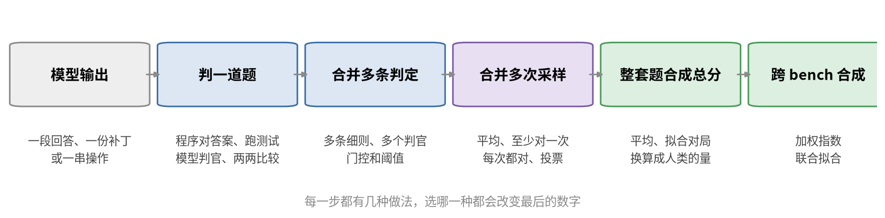

# 引言：一个分数是怎么来的

每次有新模型发布，都会附上一张长长的分数表：SWE-bench Pro 多少，HLE 多少，Arena 多少，某个指数多少。读者通常只看两件事，比上一代高了多少，比对手高了多少。这些数字本身是怎么算出来的，决定了它们能不能拿来比。

同一份判定，换一种算法，数字可以差好几倍。两道题，第一道 10 条细则过了 9 条，第二道 2 条过了 0 条：把所有细则摊平算通过率是 0.75，先在每道题内算通过率再对题平均是 0.45，要求整道题全过是 0。同一组采样，报 pass@5 是 0.92，报 pass^5 是 0。同一份对局数据，在线 Elo 按不同的比赛顺序跑，同一个模型的分数能差 70。这些数都没有算错，它们回答的是不同的问题。

这本小书讲评测的最后一段：模型的输出已经有了，怎么把它变成榜单上的那个数。出题、选题、防污染这些同样重要的话题不在讨论范围内。

一个分数从模型输出走到榜单，大致要经过下面几步：

## 四种出分的方式

附录收录的 227 个 bench，按最终分数的来路分成四类：

第一类是单独给一个模型打分，197 个。模型做一道题，拿输出去和一个标准比：标准答案、隐藏的单元测试、环境的目标状态、专家写的细则。分数不依赖其他参评模型。分数换算成人类耗时的、没有满分的、被评的是判官本身的，也都在这一类。

第二类是对照参考产出与相对比较，19 个。对手是一份固定的参考产出，或者同场的其他模型，由人、模型或游戏规则判胜负。对手是其他模型时，新模型一来，老分会动。Arena 这样影响最大的榜单就在这一类。

第三类是真实使用数据，3 个，不出题，看真实用户怎么用模型。第四类是跨 bench 合成指数，8 个，把前面那些分数再汇总成一个数。

## 这本书怎么读

第 1 章讲第一类的八个小类。第 2 章讲合并：一道题里的多条检查、多个判官、多次采样和一整套题，各自怎么合成一个数。第 3 章讲参考产出和相对比较，从固定基线讲到 Bradley–Terry，再讲平局、裁判噪声、长度偏好、配对和相对分数的代价。第 4 章讲真实使用数据，第 5 章讲跨 bench 合成指数。第 6 章讲写在数字旁边却常常没写出来的东西：跑法、谁送什么模型进来、误差条和版本。第 7 章从十几个主流榜单出发，用一段话说清每个头条数字是怎么来的。

附录说明这些 bench 的来路，并按类列出每个 bench 怎么判、怎么合成总分。正文里的数值例子都能用仓库里的两个脚本复现。
